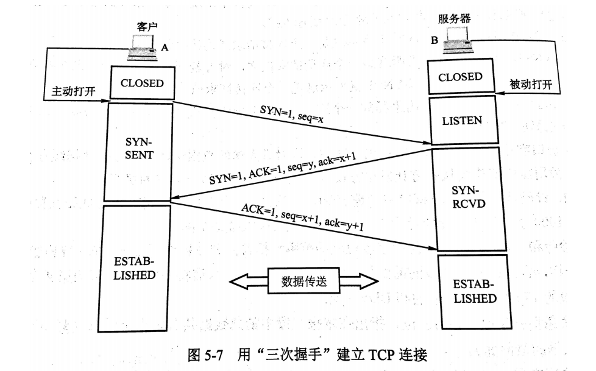
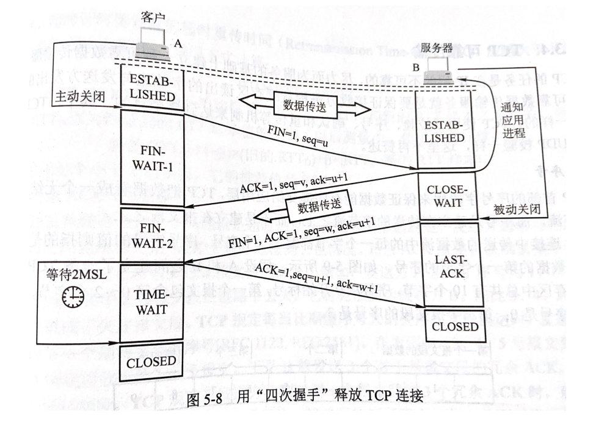
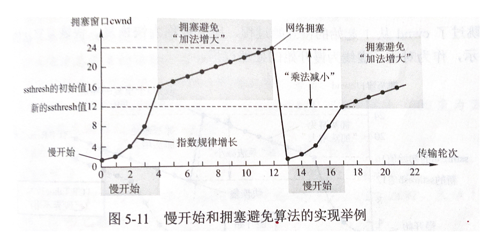
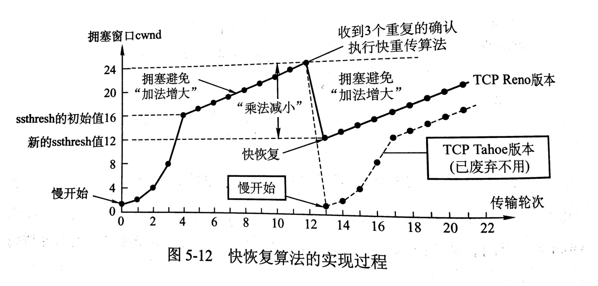
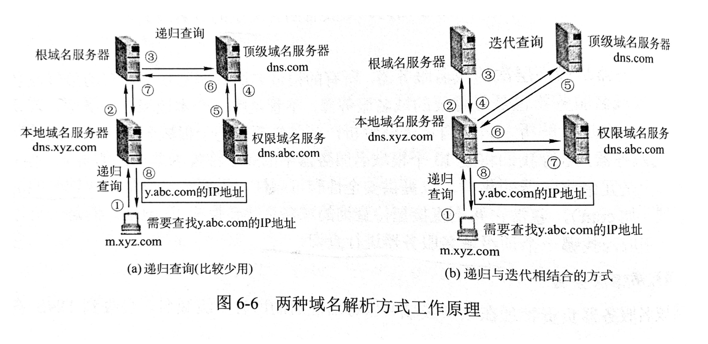
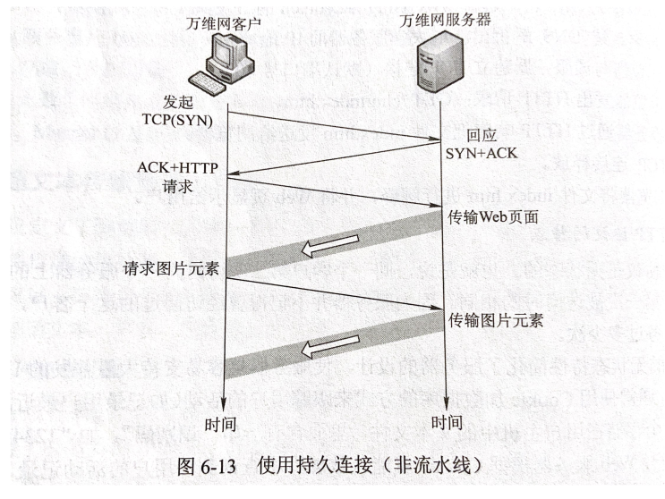
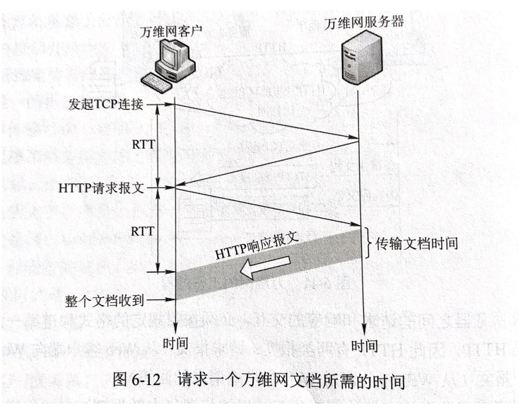
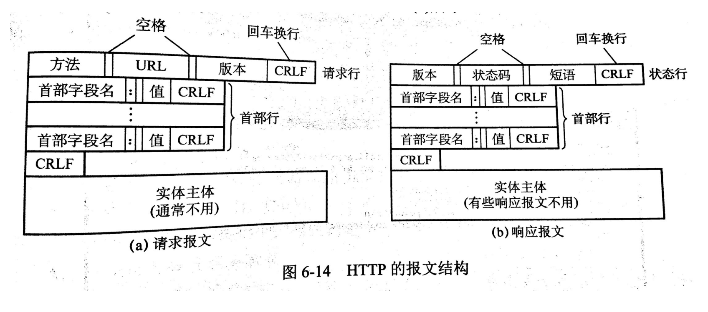

# 计算机网络

## 一、计算机网络体系结构

### 1.1 计算机网络概述

#### 1.1.1 计算机网络概念

#### 1.1.2 计算机网络组成

1. 组成部分：硬件、软件和协议
2. 工作方式：边缘、核心部分
3. 功能组成：通信子网（网络层、数据链路层、物理层）、资源子网（应用层、表示层、会话层）

#### 1.1.3 计算机网络功能

1. 数据通信
2. 资源共享
3. 分布式处理

#### 1.1.4 计算机网络分类

1. 分布范围
2. 传输技术
3. 拓扑结构
4. 使用者
5. 交换技术
6. 传输介质

#### 1.1.5 计算机网络标准化工作及相关组织

#### 1.1.6 计算机网络性能指标

1. 带宽
2. 时延
3. 时延带宽积
4. 往返时延
5. 吞吐量
6. 速率

### 1.2 计算机网络体系结构与参考模型

> 1. 实体：第N层的活动元素，同一层为对等实体
>
> 2. 协议：对等实体数据交换建立的规则、表则或约定（**语法、语义、同步**）
> 3. 接口（SAP）：上层使用下层的服务入口
> 4. 服务：下层为相邻上层提供的功能调用
>
> - 网络体系结构是从**功能**上描述计算机网络结构
> - 计算机网络体系结构是**分层结构**
> - 每层遵循某些**网络协议**以完成本层功能
> - 网络体系结构是计算机网络的**各层及其协议**的集合
>
> SDU服务数据单元：未完成用户所要求的功能应传送的数据
>
> PCI协议控制信息：控制协议操作的信息
>
> PDU协议数据单元：对等层次之间传送的数据单位

#### 1.2.1 计算机网络分层结构

#### 1.2.2 计算机网络协议、接口、服务的概念

#### 1.2.3 ISO/OSI参考模型和TCP/IP模型

1. OSI参考模型

   - 物理层

     在**物理媒体**上实现比特流的**透明传输**；单位是**比特**

     > - 定义接口特性
     > - 定义传输模式（单工、半双工、双工）
     > - 定义传输速率
     > - 比特同步
     > - 比特编码

   - 数据链路层

     把数据报**组装成帧**。传输单位是**帧**。

     > - 成帧
     >
     > - 差错控制
     >
     > - 流量控制
     > - 访问控制

   - 网络层

     IP, IPX, ICMP...

     把**分组**从源端传到目的端。单位是**数据报**

     > - 路由选择（最佳路径）
     > - 流量控制
     > - 差错控制
     > - 拥塞控制

   - 传输层

     TCP/UDP，主机**两个进程**的通信，**端到端**通信

     > - 可靠传输、不可靠传输
     > - 差错控制
     > - 流量控制
     > - 复用分用

   - 会话层

     向表示层实体进程**建立连接**并在连接上**有序**的传输数据；建立**同步**（SYN）

     > 建立管理终止会话；使用校验点在通信失败时从校验点恢复通信

   - 表示层

     > 数据格式变换、数据加密解密、数据压缩与恢复

   - 应用层

     FTP SMTP, HTTP...

2. TCP/IP参考模型

   > TCP/IP协议栈
   
   - 网络接口层
   
     对应OSI：物理+数据链路
   
   - 网际层
   
     网络层
   
   - 传输层
   
   - 应用层
   
     对应OSI：表示+会话+应用

> 1. 相同点
>
>    - 都分层
>    - 基于独立的协议栈的概念
>    - 实现异构网络互联
>
> 2. 不同点
>
>    - OSI定义：服务、协议、接口
>    - OSI先出现，参考模型先于协议发明，不偏向特定协议
>    - TCP/IP设计之初就考虑异构网络互联问题，IP作为重要层次
>
>    |        | ISO/OSI         | TCP/IP          |
>    | ------ | --------------- | --------------- |
>    | 网络层 | 无连接+面向连接 | 无连接          |
>    | 传输层 | 面向连接        | 无连接+面向连接 |

3. 5层参考模型
   - 应用层：网络应用 HTTP
   - 传输层：进程、进程数据传输 TCP, UTP
   - 网络层：源主机到目的主机的数据分组路由与转发 IP, ICMP, OSPF
   - 数据链路：把网络层传下来的数据报组装成帧 Ethernet, PPP
   - 物理层：比特传输

## 二、物理层

> 通信基础
>
> 两个公式（奈氏准则、香农定理）
>
> 编码与调制
>
> 数据交换方式（电路交换、报文交换、分组交换）
>
> 传输介质（导向、非导向传输介质）
>
> 物理层设备（中继器、集线器）

*在连接各种计算机的传输媒体上**传输数据比特流**，而不是具体的传输媒体。*

*确定传输媒体**接口**有关的一些特性：定义标准*

*接口特性：机械特性、电气特性、功能特性、规程特性*

### 2.1 通信基础

#### 2.1.1 基本概念

- 数据：传送信息的实体，有意义的符号序列

- 信号：数据的电气/电磁表现，数据在传输过程的存在形式（数字信号，模拟信号）
- 信源：产生和发送数据的源头
- 信宿：接收数据的终点
- 信道：信号的传输媒介

> 通信方式
>
> - 单工通信：单条
> - 半双工通信/双向交替：两条
> - 全双工通信：两条
>
> - 串行传输：速度慢，费用低，适合远距离
> - 并行传输：速度快，费用高，适合近距离
> - 同步传输：数据区块为单位，传送数据时先送出1个或多个同步字符
> - 异步传输：将数据分为小组传输，可能在任何时候发送这些比特组，不知道何时到达。添加字符起始位和终止位。

- 码元：**固定时长的信号波形**（数字脉冲）
- 速率：数据传输速率
  - 码元传输速率：单位时间传输的码元个数，单位为波特，与码元进制数无关，与码元长度有关
  - 信息传输速率：bit/s
- 信道带宽：信道能通过的**最高频率和最低频率之差**

#### 2.1.2 奈奎斯特定理与香农定理

- 失真

  影响失真因素：码元传输速率、信号传输距离、噪声干扰、传输媒体质量

  码间串扰：接收端收到的信号波形失去了码元之间清晰界限的现象

  - 奈氏准则：极限码元传输速率为2W波特，W是信道带宽，单位是HZ

    极限数据传输率=2W*log2V

    > 1. 任何信道中，码元传输速率有上限
    > 2. 信道频带越宽，就能更高速
    > 3. 没有给出信息传输速率限制
    > 4. 提高数据传输速率，就必须提高马原携带的比特信息量，多元制调制方法

  - 香农定理：带宽受限且有噪声的信道中，为了不产生误差，信息的数据传输速率有上限值

    信噪比=信号的平均功率/噪声的平均功率，S/N，分贝dB为单位 (dB=10*log10(S/N))

    极限数据传输速率=Wlog2(1+S/N)(b/s)

    > 1. 带宽或信噪比越大，速率越高
    > 2. 一定带宽和一定信噪比，传输速率上限就确定了
    > 3. 只要信息传输速率低于信道极限传输速率，一定有方法实现无差错传输
    > 4. 实际信道达到的传输速率要更低

#### 2.1.3 编码与调制

- 基带信号：将数字信号0和1用两种不同电压表示，再送到**数字信道**上传输。近距离
- 宽带信号：将基带信号调制后形成的频分复用模拟信号，再送到**模拟信道**上传输。远距离
- 编码：数据通转为数字信号
  1. 非归零编码：高1低0
  2. 曼彻斯特编码：中间有一次跳变，前高后低为1，前低后高为0，速率为1/2
  3. 差分曼彻斯特编码：间隔处同1异0
  4. 归零编码：信号电平在一个码元内恢复为零
  5. 反向不归零编码：0反转1不变
  6. 4B/5B
- 调制：数据转为模拟信号
  1. ASK调幅：0无振幅，1有振幅
  2. FSK调频：0低频，1高频
  3. PSK调相：0一种波，1一种波
  4. QAM调幅+调相
- 解调：PCM脉码调制（抽样，量化，编码）
  - 抽样：F采样频率>=2F信号最高频率
  - 量化：把连续的电平幅值转换为离散的数字量
  - 编码：把量化的结果转换为与之对应的二进制编码

#### 2.1.4 电路交换、报文交换与分组交换

- 电路交换：两节点之间建立一条专用的物理通信路径，可能经过许多中间节点。独占资源；适用大量数据传输

  > 优点：
  >
  > 1. 传输时延小
  > 2. 有序传输
  > 3. 没有冲突
  > 4. 实时性强
  > 5. 适用模拟信号和数字信号
  > 6. 控制简单
  >
  > 缺点
  >
  > 1. 建立连接时间长
  > 2. 线路独占
  > 3. 灵活性差
  > 4. 中间节点无数据存储能力
  > 5. 数据直达，不同终端很难相互通信
  > 6. 无法差错控制

- 报文交换（存储转发交换方式）

  报文Message：交换与传输的数据单元，栈顶**一次性要发送的数据块**。长短不一，不限且可变。

  > 优点
  >
  > 1. 无需建立连接
  > 2. 动态分配线路
  > 3. 提高线路可靠性
  > 4. 提高线路利用率
  > 5. 提供多目标服务
  >
  > 缺点
  >
  > 1. 实时性差
  > 2. 只适用于数字信号
  > 3. 报文长度无限，导致在线路拥挤时存储节点存储大量报文，提高了时延

- 分组交换（存储转发交换方式）：限制传送数据的长度
  
  分组（packet）：把数据分成小块，为一个分组。小数据块+控制信息
  
  > 优点
  >
  > 1. 无需建立连接
  > 2. 线路利用率高
  > 3. 简化了存储管理
  > 4. 加速传输
  > 5. 减少出错几率重发数据量
  > 6. 分组短小，适用于突发通信
  >
  > 缺点
  >
  > 1. 仍存在转发时延
  > 2. 每个分组加控制信息，降低了通信效率
  > 3. 接收数据后需要对分组进行重组
  
  - 数据报方式：为网络层提供**无连接服务**（不需要事先确定传输路径）
  - 虚电路方式：类似于电路交换，建立一条逻辑连接的路径；分组需要携带**虚电路号**，不需要路由选择下一主机节点；为网络层提供**连接服务**（需要事先确定传输路径）

### 2.2 传输介质

> 传输媒体不是物理层
>
> 传输介质
>
> 1. 导向性：铜线/光纤
> 2. 非导向性：空气

#### 2.2.1 双绞线、同轴电缆、光纤与无线传输介质

#### 2.2.2 物理接口的特性

### 2.3 物理层设备

#### 2.3.1 中继器

> 转发器
>
> 转发和还原，对衰减的信号放大，保持数据相同；再生数字信号

#### 2.3.2 集线器

多端口中继器

### 2.4 本章小节及疑难点

## 三、数据链路层

> 结点：主机、路由器
>
> 链路：网络中两个结点的**物理通道**；分为有线和无线
>
> 数据链路：两个结点间的**逻辑道路**，把实际控制数据传输协议的硬件和软件加到链路上就构成数据链路
>
> 帧：链路层协议数据单元，封装网络层数据报

### 3.1 数据链路层的功能

#### 3.1.1 为网络层提供服务

1. 无确认无连接：通信质量好、有线传输链路；出现差错交给上层
2. 有确认无连接
3. 有确认面向连接

#### 3.1.2 链路管理

#### 3.1.3 帧定界、帧同步与透明传输

1. 帧定界：在数据报首尾添加首部和尾部，确定帧的界限
2. 帧同步：接收方能从二进制的比特流中区分真的起始和终止
3. 透明传输：无论数据是何种比特组和都能在链路上传输。如果与控制信息一样，则应该采取措施保证接收方不认为该数据为控制信息。

#### 3.1.4 流量控制

#### 3.1.5 差错控制

### 3.2 组帧

#### 3.2.1 字符计数法

长度存在第一个字节

#### 3.2.2 字符填充的首尾定界符法

适用特定字符表示开始和结束标志，中途遇到标志符则添加转义字符，接收时删除转义字符

#### 3.2.3 比特填充的首尾标志法

首尾使用相同字符，数据比特流遇到5个1添加0

#### 3.2.4 违规编码法

使用违规码元标志开始和结束

### 3.3 差错控制

> 位错
>
> 帧错：丢失、收到多次、失序

#### 3.3.1 检错编码

1. 奇偶校验码
2. 循环冗余码

#### 3.3.2 纠错编码

海明码

### 3.4 流量控制与可靠传输机制

较高发送速度和较低接能力不匹配

数据链路层的流量控制是点对点的，而传输层的流量控制是端到端的

数据链路层流量控制手段：接收方收不下就不回复确认

传输层流量控制手段：接收端给发送端一个窗口公告

#### 3.4.1 流量控制、可靠传输与滑动窗口机制

1. 流量控制
   - 停止等待；发送窗口=1，接收窗口=1
   - 滑动窗口（**窗口大小固定**）
     - 后退N帧（GBN）：发送窗口>1，接收窗口=1
     - 选择重传（SR）：发送窗口>1，接收窗口>1
2. 可靠传输：发送端发什么，接收端就接受什么。发送端自动重传

#### 3.4.2 单帧滑动窗口与停止等待协议

发送一帧，等待接收方确认一帧；

发送方数据丢失，超时重传

接收方ACK丢失，超时重传，丢弃后再确认

接收方ACK迟到，发送方丢弃过时ACK

> 信道利用率=有效发送数据所占时间占整个发送周期比率（发送时延+往返时延+确认时延）
>
> 信道吞吐量=信道利用率*发送方发送速率

#### 3.4.3 多帧滑动窗口与后退N帧协议GBN

上层调用

**累计确认**：返回ACK确认帧则之前的所有帧都确认

超时事件：如果某一帧出错，后续所有帧都被丢弃，直到等待到出错的帧

> 接收方只按序接收帧，不按序丢弃
>
> 确认序列号最大的、按序到达的帧
>
> 发送窗口最大为2^n-1，接收窗口为1

#### 3.4.4 多帧滑动窗口与选择重传协议SR

上层调用

收到ack：若为窗口的下界，移动窗口至下界为未确认帧；如果不为下界则不动

超时事件

> 接收方接收窗口内的帧则来者不拒（失序的帧被缓存），返回确认帧。如果接收到在上一个窗口的帧，直接返回确认帧
>
> 发送和接收窗口大小为2^(n-1)

### 3.5 介质访问控制Medium Access Control

采取一定的措施，使得两节点之间的通信不会发生互相干扰的情况

#### 3.5.1 信道划分介质访问控制

静态划分信道

1. 频分多路复用FDM

   每个用户占一个频段带宽，效率较高，实现容易

1. 时分多路复用TDM

   将时间划分给不同用户，每个时间段对应不同用户

   > 统计时分复用STDM：按需动态分配时隙，效率更高

2. 波分多路复用WDM

   > 光的频分多路复用

3. 码分多路复用CDM

   码分多址CDMA：码分复用的一种方式

   1个比特对应一个m位的芯片序列：1对应芯片序列，0对应芯片序列的反码

   > 不冲突：多个站点发送数据要求各个站点芯片序列正交
   >
   > 发送：各个数据在信道中线性相加
   >
   > 接收：合并的数据和源站规格化内积

#### 3.5.2 随机介质访问控制

动态分配信道

1. ALOHA协议
   - 纯ALOHA协议：想发就发，冲突重发
   - 时隙ALOHA协议：分为不同时间片，时间片开始才能发，冲突等到下一个时间片
   
2. CSMA协议
   - 1-坚持CSMA：空闲就发，忙碌就等
   - 非坚持CSMA：空闲就发，忙碌就过一段再监听
   - p-坚持CSMA： p概率发，1-p概率推后发，忙碌过一段在监听
   
3. CSMA/CD协议：发送前，发送时都监听，边发送边监听（用于以太网）

   τ=总线传播时延

   最小帧长=2τ*数据传输速率

4. CSMA/CA协议 ：发送方发送RTS，接收方回复CTS，完成预约信道，传完后回复ACK帧（用于无线局域网）

5. 轮询访问MAC协议：轮询开销，等待延迟，单点故障

6. 令牌传递协议：令牌开销，等待延迟，单点故障

### 3.6 局域网LAN

1. 局域网

   使用广播信道

   决定局域网的主要要素：网络拓扑，传输介质，介质访问控制方法

   IEEE 802 局域网参考模型对应OSI数据链路层和物理层

   将数据链路层划分为**逻辑链路层LLC**和**介质访问控制MAC**

2. 以太网

   802.3局域网，总线拓扑，CSMA/CD访问控制

   以太网MAC帧

   物理层：前导码+以太网MAC帧

   MAC层：以太网MAC帧：目的地址，源地址，类型，数据（IP数据报），FCS

### 3.7 广域网WAN

1. PPP协议（点对点协议）

   简单

   封装成帧

   透明传输

   多种网络层协议

   多种类型链路

   差错检测

   检测连接状态

   最大传输单元

   网络层地址协商

   数据压缩协商

2. HDLC协议

### 3.8 数据链路层设备

1. 网桥：根据MAC帧的目的地址决定转发，过滤

   - 透明网桥
   - 源路由网桥

2. 以太网交换机

   直通式交换机

   存储转发式交换机

### 3.9 本章小结及疑难点

## 四、网络层

### 4.1 网络层的功能

1. 路由选择与分组转发

2. 异构网络互联

3. 拥塞控制

### 4.2 路由算法

#### 4.2.1 静态路由与动态路由

- 静态路由算法：管理员手动配置信息

- 动态路由算法：路由器彼此交换信息，按照路由算法优化路由表项

#### 4.2.2 距离向量路由算法RIP

分散性

#### 4.2.3 链路状态路由算法OSPF

全局性

#### 4.2.4 层次路由

- 自治系统AS

- 路由选择协议
  - 内部网关协议IGP：一个AS内使用的 RIP, OSPF
  - 外部网关协议EGP：AS之间使用 BGP

### 4.3 IPv4

#### 4.3.1 IPv4分组

1. 分组的格式

   - IP数据报：首部，数据部分（TCP、UDP段）

     - 首部：固定部分，可变部分
     - 版本4位，首部长度4位（最小为5，0101），区分服务8位，总长度16
     - 标识16位，标志3位，片偏移13位
     - 生存时间8位，协议8位（数据部分的协议，TCP=6，UDP=17......），首部检验和16位：只检验首部
     - 源地址32位
     - 目的地址32位
     - 可选字段，填充（补全首部为4字节整数倍）

   - IP数据报分片

     - 不同分片IP首部标识不变
- 标志字段只有两位有意义，中间位（DF=1禁止分片，DF=0允许分片），最低位（MF=1后面还有分片，MF=0最后一个分片）
     - 片偏移：该片在原来数据报中的位置，以8B为单位（除了最后分片数据部分都是8B整数倍）

#### 4.3.2 IPv4地址与NAT

1. IPv4地址

   - IP地址={<网络号>，<主机号>}

   - IP地址的分类
     - A类（1-126）
     - B类（128-191）
     - C类（192-223）
     - D类：多播地址
     - E类
   - 特殊IP地址
     - 全0+全0：可为源地址，不能为目的地址，表示本网范围内所有主机
     - 全0+特定值：不可为源地址，可为目的地址，表示本网范围某个特定主机
     - 全1+全1：不可为源地址，可为目的地址，本网广播地址（路由器不转发）
     - 特定值+全0：不可为源地址，不可为目的地址，特定网络地址
     - 特定值+全1：不可为源地址，可为目的地址，直接广播地址，对特定主机所有主机广播
     - 127+任意数：可以，可以，本地软件环回测试
   
2. 网络地址转换

   NAT转换表：WAN端，LAN端（IP和端口号）互相转换

#### 4.3.3 子网划分与子网掩码、CIDR

1. 子网划分

   提高IP地址空间的利用率

   划分子网的基本思路：

   - 划分子网属于单位内部的事，对外表现为没有划分过的网络
   - IP地址结构 {<网络号>，<子网号>，<主机号>}
   - 其他网络发送给本单位某个主机的IP数据报，仍然是根据IP数据报的目的网络号，先找到连接在本单位网络上的路由器。路由器根据收到的数据报按目的网络和子网号找到目的子网，最后把数据报交给目的主机。

2. 子网掩码

   一串1+一串0；与目的地址做“与”运算得到目的子网

3. 无分类编址CIDR

   IP地址后加上“/”，写上网络前缀的位数 e.g. 128.14.32.0/20

   路由选择最长前缀匹配作为下一跳，地址块更小，效率更高

#### 4.3.4 ARP协议、DHCP协议与ICMP协议

1. IP地址与硬件地址

   > 1. 在IP层抽象的互联网上只能看到IP数据报
   > 2. 虽然在IP数据报首部有完整的源IP地址和目的IP地址，但是路由器只根据目的IP地址的网络号进行路由选择
   > 3. 在局域网链路层，只能看见MAC帧。而通过路由器转发IP分组时，此IP分组在每个网络中都被路由器解封装和重新封装。因此IP数据报在被路由器转发时其数据链路层使用的MAC地址是不断变化的，这决定了无法使用MAC地址无法跨网络通信

2. 地址解析协议ARP：完成主机或路由器IP地址到MAC地址的映射

   检查**ARP高速缓存**，有则写入MAC帧，没有则利用目标MAC地址为FF-FF-FF-FF-FF-FF的帧封装**广播ARP请求分组**，同一局域网内所有主机都能收到该请求。目的主机收到请求后会向源主机**单播一个ARP响应分组**，源主机收到后将此写入**ARP缓存**

3. 动态主机配置协议DHCP（**应用层协议，基于UDP**）

   **广播获取**动态获取IP地址

4. 网际控制报文协议ICMP（**网络层协议**）：发送特定ICMP报文。e.g. Ping Traceroute

   - ICMP差错报告报文（**网络层传输单元（IP数据报）的数据部分**）：
     - 四个字节（一样）：类型8位，代码8位，检验和16位
     - 四个字节：取决于ICMP报文类型
     - ICMP数据部分（长度取决于类型）

   - 类型

     - 终点不可达：无法交付
     - 源点抑制：拥塞丢数据
     - 时间超过：TTL=0
     - 参数问题：首部字段有问题
     - 改变路由（重定向）：值得更好的路由

   - 装入ICMP报文的IP数据报：

     - IP首部

     - ICMP差错报告报文：ICMP前8字节，收到的IP数据报首部，收到的IP数据报数据部分前8字节

### 4.4 IPv6

#### 4.4.1 IPv6的主要特点

> IPv6数据报
>
> 1. 基本首部40字节：
>    - 版本4位，优先级8位，流标签20位
>    - 有效载荷长度16位，下一首部8位，跳数限制8位（TTL）
>    - 源地址
>    - 目的地址
>
> 2. 有效载荷：拓展首部，数据部分

1. 更大的地址空间：128位
2. 拓展的地址层次结构
3. 灵活的首部
4. 改进的选项
5. 允许协议继续扩充
6. 支持**即插即用**，自动配置IP地址
7. 支持资源的预分配
8. IPv6只在**包的源节点允许分片**
9. IPv6首部必须是**8B整数倍**，IPv4是4B的整数倍
10. 增加了安全性

#### 4.4.2 IPv6地址

1. 一般形式：冒分十六进制法

2. 压缩形式：零压缩

1. 单播：一对一通信，可做源地址和目的地址
2. 多播：一对多通信，可做目的地址
3. 任播：一对多中的一个通信，可做目的地址

1. 双栈协议：同时启用IPv4和IPv6协议
2. 隧道技术：将其他协议的数据帧或包重新封装然后通过隧道发送

### 4.5 路由协议

#### 4.5.1 自治系统

#### 4.5.2 域内路由与域间路由

- 内部网关协议IGP：一个AS内使用的 RIP, OSPF
- 外部网关协议EGP：AS之间使用 BGP

#### 4.5.3 RIP路由协议（应用层协议，使用UDP传送数据）

每一个路由器维护从它自己到其他每一个目的网络的唯一最佳距离记录，距离通常为跳数，即经过路由器个数。RIP允许一条路由只能包含15个路由器，因此RIP只适用于小互联网

1. 只和相邻路由器交换信息
2. 路由器交换的信息是自己的路由表
3. 每30秒交换一次信息，超过180s没有收到邻居路由器通告，则更新自己路由表

距离向量算法

1. 修改相邻路由器发来的RIP报文中所有表项：把下一跳改为X，把距离加1
2. 对修改后的RIP报文每一项都进行更新
   - 没有目的网络则直接添加表项
   - 有目的网络，下一跳为X则更新表项
   - 有目的网路，下一跳不为X则选择最优表项
   - 超时则标为不可达路由

#### 4.5.4 OSPF路由协议（使用IP数据报传送）

1. 基本特点
   1. 向本自治系统所有路由器发送信息，使用洪泛法
   2. 发送的信息是本路由器相邻的所有路由器的链路状态（本路由器和那些路由器相邻，及链路的度量/代价）
   3. 链路状态发生变化时，路由器才向所有路由器洪泛发送信息

2. 基本工作原理

   建立链路状态数据库，实际上就是**全网的拓扑结构图**

3. 五种分组类型

   1. HELLO问候分组：了解相邻节点的网络地址
   2. DD数据库描述分组：向邻站给出自己链路状态数据库的所有链路状态项目的摘要信息，如果都有则不处理，如果有没有或者更新的，发送LSR链路状态请求分组请求信息
   3. LSR链路状态请求分组：请求更新
   4. LSU链路状态更新分组：返回更新数据
   5. LSAck链路状态确认分组：更新确认

> 每隔30min，刷新一次数据库中的链路状态
>
> 每个路由器链路状态只涉及相邻路由器联通状态，互联网规模很大时，比RIP协议要好
>
> 收敛速度很快

#### 4.5.5 BGP路由协议（应用层协议，基于TCP）

与其他AS的BGP发言人交换信息

交换网络可达性的信息，要达到某个网络所要经过的一系列AS

发生变化时更新有变化的部分

> BGP-4报文
>
> 1. OPEN报文：与相邻BGP发言人建立关系，认证发送方
> 2. UPDATE报文：通告新路径或撤销原路径
> 3. KEEPALIVE报文：无UPDATE时,周期性验证邻站连通性；OPEN的确认
> 4. NOTIFICATION报文：发送检测的差错

### 4.6 IP组播

#### 4.6.1 组播的概念

一点对多点发送数据报

源主机把单个分组发送给一个组播地址

#### 4.6.2 IP组播的地址

组播地址范围224.0.0.0~239.255.255.255(D类地址)

组播地址只能为目的地址,源地址一定为单播地址

1. 组播数据报也是尽最大努力交付,不提供可靠交付,应用于UDP
2. 对组播数据报不产生ICMP差错报文
3. 并非所有D类地址都可以作为组播地址

硬件组播

在局域网内，组播IP地址也要映射为MAC地址在网内传送帧。组播MAC地址以01-00-5E开头，余下6个十六进制位根据IP组播地址最后23位转换得到的

#### 4.6.3 IGMP协议与组播路由算法

IGMP协议：让链接在本地局域网上的组播路由器知道本局域网是否有主机参加或退出了某个组播组

组播路由选择算法：基于链路状态的路由选择，基于距离向量的路由选择，协议无关的组播

### 4.7 移动IP

#### 4.7.1 移动IP的概念

#### 4.7.2 移动IP通信过程

1. 移动IP在本地网，按传统TCP/IP方式进行通信

2. 移动节点漫游到另一个外地网络后，仍使用固定IP地址进行通信，移动节点向本地代理注册当前的位置地址，位置地址就是转交地址
3. 本地代理接收到转交地址的注册后，会构建一条通向转交地址的隧道，将截获的IP分组通过隧道转交给转交地址处
4. 在转交地址处解除封装，恢复原始的IP分组
5. 移动节点在外网通过外网的路由器或者外代理向通信对端发送IP数据包
6. 当移动节点来到另一个外网，须向本地代理更新注册的转交地址
7. 移动节点会到本地网时，移动节点向本地代理注销转交地址

### 4.8 网络层设备

#### 4.8.1 路由器的组成和功能

- 路由选择

  路由选择处理机

- 分组转发

  交换结构

  一组输入端口

  一组输出端口

- 三层设备的区别

  |                          | 能否隔离冲突域 | 能否隔离广播域 |
  | ------------------------ | -------------- | -------------- |
  | 物理层（中继器、集线器） | ×              | ×              |
  | 链路层（网桥、交换机）   | √              | ×              |
  | 网络层（路由器）         | √              | √              |

#### 4.8.2 路由表和路由转发

### 4.9 本章小结及疑难点

## 五、传输层

***只有主机才有的层次***

### 5.1 传输层提供的服务

#### 5.1.1 传输层的功能

1. **进程和进程**之间的逻辑通信
2. 复用和分用
3. 对出错的报文进行差错检测
4. 传输层的两个协议

#### 5.1.2 传输层的寻址与端口

1. 端口：主机中的SAP，标识主机中的应用进程
2. 端口号
   - 只有本地意义，在因特网中相同端口无联系
   - 长度为16位，能表示65535个不同端口号
   - 服务端使用：熟知端口号（0-1023）重要应用程序；等级端口号（1024-65535）为没有熟知端口号的应用程序使用 FTP21, Telnet23, SMTP25, DNS53, TFTP69, HTTP80, SNMP161
   - 客户端使用：使用时动态分配
3. 套接字Socket：(主机IP地址，端口号)唯一标识网络中的一个主机和它上面的一个进程

### 5.2 UDP协议

#### 5.2.1 UDP数据报

1. UDP概述
   - 无连接
   - 不保证可交付
   - 面向报文，适合一次性传输少量数据的网络应用
   - 无拥塞控制，适合很多实时应用
   - 首部开销小，8字节
2. UDP首部格式
   - 源端口16位，目的端口16位
   - UDP长度16位，UDP检验和16位

#### 5.2.2 UDP校验

- 计算校验和时，要在UDP数据报之前加上12字节的伪首部，不是UDP真正的首部，不想上递交，也不向下传送，而是为了计算校验和二临时加上去的

- 二进制求和，再求反码得到校验和

### 5.3 TCP协议

#### 5.3.1 TCP协议的特点

1. 面向连接（虚连接）的传输层协议
2. 只能由两个端点，每一条TCP连接只能是点对点的
3. 提供可靠交付的服务，无差错，不丢失，不重复，按序到达
4. 提供全双工通信，设置发送和接收缓存
5. 面向字节流，把数据看成无结构的字节流

#### 5.3.2 TCP报文段

1. TCP首部（4B的整数倍）
   - 源端口16位（2B），目的端口16位（2B）
   - 序号4B（发送数据的第一个字节的序号）
   - 确认号4B（期望收到对方下一个数据字节的序号）
   - 数据偏移4位（首部长度），保留6位，**URG位**（紧急位），**ACK位**（确认位），PSH位（推送位），RST位（复位），**SYN位**（同步位），**FIN位**（终止位），窗口2B（现在允许对方发送的数据量，接收窗口）
   - 检验和2B，紧急指针2B（紧急数据的字节数）
   - 选项（可变）

#### 5.3.3 TCP连接管理

连接建立，数据传送，连接释放

客户服务器模式

1. TCP连接的建立
   - 客户端发送**连接请求报文段**，无应用层数据：SYN=1, seq=x(随机)
   - 服务器端位该TCP连接**分配缓存和变量**，并向客户端返回**确认报文段**，允许连接，无应用层数据：SYN=1, ACK=1, seq=y(随机), ack=x+1
   - 客户端位该TCP连接**分配缓存和变量**，并向服务器端返回确认的确认，可以携带数据：SYN=0, ACK=1, seq=x+1, ack=y+1
   - SYN洪泛攻击：设置SYN Cookie

1. TCP连接释放

   参与连接的两个进程的任意一个都能终止该连接，连接结束后，主机中的资源（缓存和变量）将被释放

   - 客户端发送**连接释放报文段**，停止发送数据，主动关闭TCP连接：FIN=1, seq=u
   - 服务器端回送一个确认报文段，客户到服务器这个方向的连接就释放了——半关闭状态：ACK=1, seq=v, ack=u+1
   - 服务器端发送完数据，发出**连接释放报文段**，主动关闭TCP连接：FIN=1, ACK=1, seq=w, ack=u+1
   - 客户端回送确认报文段，等到时间等待计时器设置的2MSL（最长报文段寿命）后，连接彻底关闭：ACK=1, seq=u+1, ack=w+1

#### 5.3.4 TCP可靠传输

可靠：保证接收方进程从缓冲区读出的字节流与发送方发出的字节流时完全一样的

1. 校验：添加伪首部
2. 序号
3. 确认
4. 重传
   - 超时重传（自适应算法，动态改变重传时间RTTs）
   - 冗余ACK（冗余确认）：每当比期望序号大的失序报文段到达时，发送一个**冗余ACK**，指明下一个期待字节的序号。**快速重传**

#### 5.3.5 TCP流量控制（端到端）

**滑动窗口**

接收方根据自己**接收缓存的大小**，动态调整发送方的发送窗口大小，即接收窗口rwnd（接收方设置确认报文段的**窗口字段**来讲rwnd通知给发送方），发送方的**发送窗口取接收窗口rwnd和拥塞窗口cwnd的最小值**

***发送窗口可以动态变化***

> TCP为每一个连接设有一个持续的计时器，只要TCP连接的一方收到对方的零窗口通知，启动持续计时器.
>
> 时间到期,就发送一个零窗口探测报文段，收到报文的接收方给出现在的窗口值

#### 5.3.6 TCP拥塞控制（全局）

对资源的需求总和>可用资源

防止过多的数据注入到网络中。**全局性**，涉及所有主机和路由器

接收窗口：**接收方**根据接收缓存设置的值，告知发送方，反应接收方容量

拥塞窗口：**发送方**根据自己估算的网络拥塞程度二设置的窗口值，反应网络当前容量

1. 慢开始和拥塞避免

   一个传输轮次=发送一批报文段并受到确认的时间=RTT=开始发送一批到发送下一批的时间

   - 慢开始：不断增加拥塞窗口，指数增大，到达ssthresh阈值后，转为使用拥塞避免算法
   - 拥塞避免：线性增大拥塞窗口，检测到网络拥塞，则降为慢开始算法，拥塞窗口降为1，更新ssthresh=拥塞窗口最大值/2

   

2. 快重传和快恢复

   - 快重传：收到3个重复的确认报文段，执行快重传

   - 快恢复：拥塞窗口降为最大拥塞窗口的一半，之后执行拥塞避免算法，线性增大窗口大小

     

### 5.4 本章小结及疑难点

1. 2MSL？

   > 一、保证TCP协议的全双工连接能够可靠关闭
   > 二、保证这次连接的重复数据段从网络中消失
   >
   > 先说第一点，如果Client直接CLOSED了，那么由于IP协议的不可靠性或者是其它网络原因，导致Server没有收到Client最后回复的ACK。那么Server就会在超时之后继续发送FIN，此时由于Client已经CLOSED了，就找不到与重发的FIN对应的连接，最后Server就会收到RST而不是ACK，Server就会以为是连接错误把问题报告给高层。这样的情况虽然不会造成数据丢失，但是却导致TCP协议不符合可靠连接的要求。所以，Client不是直接进入CLOSED，而是要保持TIME_WAIT，当再次收到FIN的时候，能够保证对方收到ACK，最后正确的关闭连接。
   >
   > 再说第二点，如果Client直接CLOSED，然后又再向Server发起一个新连接，我们不能保证这个新连接与刚关闭的连接的端口号是不同的。也就是说有可能新连接和老连接的端口号是相同的。一般来说不会发生什么问题，但是还是有特殊情况出现：假设新连接和已经关闭的老连接端口号是一样的，如果前一次连接的某些数据仍然滞留在网络中，这些延迟数据在建立新连接之后才到达Server，由于新连接和老连接的端口号是一样的，又因为TCP协议判断不同连接的依据是socket pair，于是，TCP协议就认为那个延迟的数据是属于新连接的，这样就和真正的新连接的数据包发生混淆了。所以TCP连接还要在TIME_WAIT状态等待2倍MSL，这样可以保证本次连接的所有数据都从网络中消失。

## 六、应用层

### 6.1 网络应用模型

对应用的通信提供服务

> 应用进程交换的报文类型，请求还是响应
>
> 各种报文类型的语法，如报文中的各个字段及其详细描述
>
> 字段的语义，包还在字段中的信息的含义
>
> 进程何时，如何发送报文，以及对报文进行响应的规则

#### 6.1.1 客户/服务模型

1. 服务器：提供计算服务的设备
   - 永久提供服务
   - 永久性访问地址/域名
2. 客户机：请求计算服务的主机
   - 与服务器通信，使用服务器提供的服务
   - 间歇性接入网络
   - 可能使用动态IP地址
   - 不与其他客户机直接通信

#### 6.1.2 P2P模型

- 不存在永远在线的主机
- 每个主机既可以提供服务，也可以请求服务
- 任意端系统/节点之间可以直接通讯
- 间歇性接入网路
- 可扩展性好
- 网络健壮性强

### 6.2 DNS系统（基于UDP）

#### 6.2.1 层次域名空间

- 根
- 顶级域名
  - 国家顶级域名 cn, us, uk
  - 通用顶级域名 com, net, org, gov, int, aero, museum, travel
  - 基础结构域名/反向域名 arpa
- 二级域名
  - 类别域名 ac, com, edu, gov, mil, net, org
  - 行政区域名 bj, js
  - 其它
- 三级域名：mail, www ...
- 四级域名：mail, www ...

#### 6.2.2 域名服务器

- 根域名服务器：可以查询到所有顶级域名服务器地址
- 顶级域名服务器：可以查询二级域名服务器地址
- 权限域名服务器（负责一个区的域名服务器）
- 本地域名服务器：当一个主机发出DNS查询请求，这个查询请求报文就会发给本地域名服务器

#### 6.2.3 域名解析过程

- 迭代查询
- 递归查询

### 6.3 文件传输协议FTP

#### 6.3.1 FTP工作原理

**基于C/S**，使用**TCP**实现可靠传输

#### 6.3.2 控制连接与数据连接

- 控制连接：21端口，**始终**打开，传请求
- 数据连接：20端口（与传输模式有关），传文件，传完毕则关闭连接
- FTP传输模式：ASCII模式，二进制模式

### 6.4 电子邮件

#### 6.4.1 电子邮件系统的组成结构

- 用户代理：用户与电子邮件系统的接口
- 邮件服务器：核心环节。发送和接收邮件
- 电子邮件使用的协议：发送（SMTP），接收（POP3，IMAP）

#### 6.4.2 电子邮件格式与MIME

#### 6.4.3 SMTP协议和POP3协议

1. SMTP协议（TCP，端口号25，C/S）：两个相互通信的SMTP进程之间如何交换信息
   - 连接建立
   - 邮件传送
   - 连接释放
2. POP3（TCP，端口110，C/S）：下载保留/删除

### 6.5 万维网WWW

#### 6.5.1 www的概念与组成结构

大规模的、联机式的信息贮藏所/**资料空间**，无数个网络站点和网页的集合

**统一资源定位器URL**<协议>//<主机>:<端口>/<路径>

#### 6.5.2 超文本传输协议HTTP

- 操作过程
  1. 浏览器分析链接指向的URL
  2. 浏览器向DNS请求解析域名的IP地址
  3. 域名系统DNS解析出对应的IP地址
  4. 浏览器与该服务器建立TCP连接，端口号默认８０
  5. 浏览器发出HTTP请求
  6. 服务器通过HTTP响应把文件发送给客户端
  7. TCP连接释放
  8. 浏览器解析获取的响应，展示给用户
  
- 特点
  
  1. 无状态的；Cookie存储在用户主机的文本文件，记录某用户访问记录
  
  2. HTTP本身是无连接的，但是使用了TCP作为传输层协议
  
  3. 支持持久连接keep-alive和非持久连接close
  
     
  
     
  
- 报文

  1. 请求报文

  2. 响应报文

     

