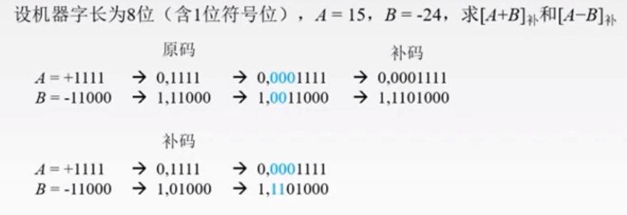
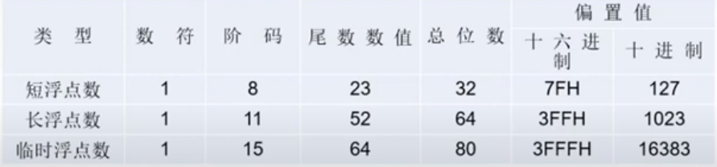
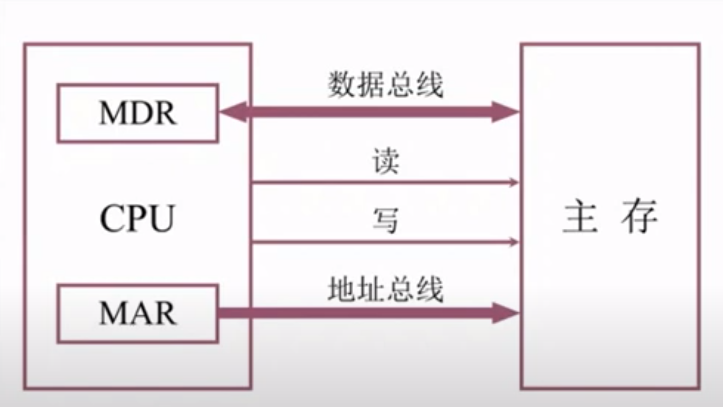

# 计算机组成原理

## 一、计算机系统概述

### 1.1 计算机发展历程

#### 1.1.1 计算机硬件的发展

1. 计算机的四代变化
2. 计算机原件的更新换代

#### 1.1.2 计算机软件的发展

#### 1.1.3 计算机的分类与发展方向

### 1.2 计算机系统的层次结构

#### 1.2.1 计算机系统的组成

- 硬件系统
- 软件系统

#### 1.2.2 计算机硬件的基本组成

1. 早期的冯诺依曼机：**运算器为核心**

   - 五大部件
   - 指令和数据存储在存储器中，并可按**地址**寻访
   - 指令和数据一二进制代码表示
   - 指令由操作码和地址组成，操作码用来表示操作的性质，地址码表示操作数在存储器中的位置
   - 指令在存储器中按顺序存放。通常指令是顺序执行的，特定条件下可根据运算结果或设定的条件改变执行顺序
   - 早期冯诺依曼机以运算器为核心，输入输出设备通过运算器与存储器传送数据

2. 现代计算机组织结构：**存储器为核心**

3. 计算机的功能部件

   1. 输入设备

   2. 输出设备

   3. 存储器

      - MAR地址寄存器
      - MDR数据寄存器
      - 存储体
      - 存储元：1位
      - 存储单元：多个存储元组成。1B为8个存储元**存储字长**
      - 译码器：将二进制地址转换为读取的物理存储单元。n位地址对应2^n个存储单元

      > MDR和MAR实际上在CPU中

   4. 运算器

      - MQ乘商
      - ACC累加
      - **ALU算术逻辑单元**Arithmetic and Logic Unit
      - X操作数
      - PSW

   5. 控制器

      - CU控制单元Control Unit
      - IR指令寄存器Instruction Register
      - PC程序计数器Program Counter

#### 1.2.3 计算机软件的分类

1. 系统软件和应用软件
2. 三个级别的语言
   - 机器语言
   - 汇编语言
   - 高级语言

#### 1.2.4 计算机的工作过程

- 取指令：PC->MAR->M->MDR->IR
- 分析指令：OP(IR)->CU
- 执行指令：AD(IR)->MAR->M->MDR->ACC

> **CPU区分指令和数据的依据：指令周期的不同阶段**

#### 1.2.5 计算机系统的多级层次结构

- 虚拟机器M4：高级语言机器
- 虚拟机器M3：汇编语言机器
- 虚拟机器M2：操作系统机器
- 传统机器M1：微程序解释机器指令
- 微程序机器M0：硬件直接执行微指令

### 1.3 计算机的性能指标

#### 1.3.1 计算机的主要性能指标

> 容量，速度

1. 机器字长：计算机进行一次整数运算所能处理的二进制数据的位数

   一般等于内部寄存器的大小

2. 数据通路带宽

   一次并行传送信息的位数

3. 主存储量：字数 × 字长（2^地址位数 × MDR位数）

4. 运算速度

   - 吞吐量：系统在单位时间处理请求的数量
   - 响应时间：用户发送一个请求，系统对该请求做出响应并获得它所需结果的等待时间
   - CPU时钟周期
   - CPU主频=1/CPU时钟周期
   - CPI执行一条指令所需时钟周期数
   - 指令耗时=CPI*CPU时钟周期
   - MIPS, MFLOPS, GFLOPS, TFLOPS

#### 1.3.3 几个专业术语

### 1.4 本章小结

1. 计算机由哪几部分组成？以哪部分为中心？
2. 主频高的CPU一定比主频低的CPU快吗？
3. 翻译程序、汇编程序、编译程序、解释程序有什么区别
4. 不同级别程序语言编写的程序有什么区别

## 1.5 常见问题与易混淆点

1. 同一个功能可以既由软件又由硬件实现吗？
2. 什么是透明性？
3. 机器字长，指令字长，存储字长？
4. 计算机体系结构和计算机组成区别和联系？

## 二、数据的表示和运算

### 2.1 数制与编码

#### 2.1.1 进位计数值及相互转换

1. 进位计数法
   - 基数
2. 相互转换
   - 任意进制转换为十进制 Kn × r^n +...+ K1 × r^1 + K0 × r^0
   - 十进制转换为任意进制数
     - 整数部分，使用除法得到商和余数
     - 小数部分，使用乘法得到整数部分和小数
   - 二进制转换为四、八、十六进制：n个一组直接转换
   - 四、八、十六进制转换为二进制：每位写为二进制

#### 2.1.2 真值与机器数

#### 2.1.3 BCD码 Binary-Coded Decimal

1. 8421码
   - 0-9十进制数一一映射
   - 大于9的十进制数加6修正
2. 余3码：8421码+3
3. 2421码：最高位权值为2

#### 2.1.4 字符与字符串

1. 字符编码ASCII码

   - ASCII码：128个字符，7位的二进制编码

   - 可印刷字符：32-126
   - 数字：48-57
   - 大写字母：65-90
   - 小写字母：97-122

2. 字符串

   - 大端模式：先存高位
   - 小端模式：先存低位

3. 汉字表示

   - 区位码
   - 国标码：区位码+20H
   - 汉字内码：国标码+80H

#### 2.1.5 校验码

1. 奇偶校验码
   - 奇校验码：整个校验码中1的个数为奇数
   - 偶校验码：整个校验码中1的个数为偶数
2. 海明码
   - 确定海明码的位数，校验位k：2^k>=n+k+1
   - 确定校验位的分布：校验位Pi放在海明码2^(i-1)的位置
   - 求校验位的值
   - 纠错
3. 循环冗余码CRC：K位信息位，R位校验位
   - 确定K，R以及生成多项式对应二进制码
   - 移位，低位补0
   - 相除得到余数为校验位

### 2.2 定点数的表示和运算

#### 2.2.1 定点数的表示

1. 无符号数和有符号数的表示
2. 机器数的定点表示
3. 原码、补码、反码、移码
   - 原码（正负符号化）
   - 补码（简化加减运算）
     - 正数：[x]补=[x]原
     - 负数：[x]补=原码符号位不变，取反加一
   - 反码（原码到补码的过渡）
     - 正数：[x]反=[x]原
     - 负数：[x]反=原码符号位不变，按位取反
   - 移码（移码大真值就大）：整数 [x]移=x+2^n

#### 2.2.2 定点数的运算

> 数据相对于小数点**左移**

1. 定点数的移位运算

   - 算术移位：机器码采用有符号数，符号位不参与移位

     - 正数：添0
     - 负数：原码添0；补码左移添0，右移添1；反码添1

     > 左移丢1，运算出错；右移丢1，影响精度

   - 逻辑移位：计算采用无符号数

     - 逻辑左移，高位丢弃，低位添0
     - 逻辑右移，低位丢弃，高位添0

   - 循环移位

2. 原码定点数的加减法运算

3. 补码定点数加减法运算

4. 符号扩展

   

5. 溢出概念和判别方法

   - 采用一位符号位
   - 采用双符号位
   - 采用一位符号位，根据数据位的进位情况判断溢出

6. 定点数的乘法运算

   - 原码一位乘法
   - 补码一位乘法booth算法

7. 定点数的除法运算

   - 原码恢复余数法
   - 原码不恢复余数法
   - 补码加减交替法

#### 2.2.3 强制类型转换

1. 无符号数变为有符号数：不改变数据内容，改变解释方式
2. 长整数变为短整数：高位截断，保留低位
3. 短整数变为长整数：符号扩展

### 2.3 浮点数的表示和运算

#### 2.3.1 浮点数的表示

1. 浮点数的表示格式（类似科学计数法）

   阶码（决定小数点位置）+尾数（决定精度）

2. 规格化浮点数

   - 左规：位数的数据部分最高位为1（提高精度），阶码减1
   - 右规：加法出现溢出，阶码加1

3. 浮点数表示范围

   - 负下溢，正下溢：当作0
   - 正上溢，负上溢

4. IEEE 754标准

   - 尾数符号位移到前面，尾数使用原码表示，隐藏最高位1

   - 阶码数据使用移码表示

     

#### 2.3.2 浮点数的加减运算

1. 对阶
2. 尾数求和
3. 规格化
4. 舍入
5. 判溢出
6. 强制类型转换

### 2.4 算术逻辑单元ALU

加，减，乘，除

与，或，非，异或

移位，求补

#### 2.4.1 串行加法器和并行加法器

1. 一位全加器
2. 串行加法器：成本低，运算速度快
3. 并行加法器
   - 串行进位：依赖于前一级的进位
   - 并行进位
     - 单级先行进位方式
     - 多级先行进位方式

#### 2.4.2 算术逻辑单元的功能和结构

## 三、存储系统

### 3.1 存储器的层次结构

#### 3.1.1 存储器的分类

1. 按在计算机中的作用（层次）分类
   - 主存储器 DRAM, ROM
   - 辅助存储器
   - 高速缓冲存储器Cache SRAM
2. 按存储介质分类
   - 磁芯存储器
   - 磁表面存储器：磁盘磁带
   - 半导体存储器
   - 光存储器
3. 按存取方式分类
   - 随机存取
     - 随机存储器RAM
     - 只读存储器ROM
   - 串行访问存储器
     - 直接存取：磁盘
     - 顺序存取：磁带
4. 按信息的可保存性分类
   - 断电后是否消失
     - 易失：RAM
     - 不易失
   - 读出时是否破环数据
     - 破环性读出：DRAM
     - 非破环性读出

#### 3.1.2 存储器的性能指标

1. 存储容量：存储字数×字长
2. 单位成本：每位价格=总成本/总容量
3. 存储速度：数据传输率=数据的宽度/存储周期
   - 存取时间：启动一次存储器操作到完成操作的时间
   - 存取周期：存储器完成一次完整的读写操作所需的全部时间
   - 主存带宽：每秒从主存中进出信息的最大数量

### 3.2 存储系统的层次化结构

#### 3.2.1 多级存储系统

CPU<->Cache<->主存<->辅存

1. Cache，主存层次：硬件实现，解决速度不匹配的问题
2. 主存，辅存层次：硬件+操作系统实现，解决容量问题，虚存

### 3.3 半导体随机存储器

#### 3.3.1 半导体存储芯片

1. 半导体存储芯片的基本结构
   - 存储矩阵：大量相同的位存储单元构成
   - 译码驱动：将地址翻译成对应存储单元的信号
   - 读写电路：完成读写操作
   - 读写控制线：决定哪个芯片用来读写
   - 片选线：确定哪一个存储芯片被选中
   - 地址线：单向输入，位数决定存储字个数
   - 数据线：双向，位数取决于数据位数

#### 3.3.2 SRAM和DRAM

1. SRAM工作原理

   - 双稳态

2. DRAM工作原理

   - 电容

   - 使用行列地址

3. 存储器的读写周期

#### 3.3.3 只读存储器

1. 只读存储器ROM特点
2. ROM的类型

### 3.4 主存储器与CPU的连接

#### 3.4.1 连接原理

1. 主存储器通过数据总线、地址总线和控制总线与CPU连接
2. 数据总线位数与工作频率的乘积正比于数据传输率
3. 地址总线的位数决定了可寻址的最大内存空间
4. 控制总线指出总线周期的类型和本次输入输出操作完成的时刻

#### 3.4.2 主存容量的扩展

1. 位扩展法
2. 字扩展法
   - 线选法：地址空间不连续，电路简单
   - 译码片选法：地址空间可连续，增加逻辑设计
3. 字位同时扩展法

#### 3.4.3 存储芯片的地址分配和片选

#### 3.4.4 存储器与CPU的连接

### 3.5 双端口RAM和多模块存储器

#### 3.5.1 双端口RAM

#### 3.5.2 多模块存储器

1. 单体多字存储器
2. 多体并行存储器
   - 高位交叉编址
   - 低位交叉编制

### 3.6 高速缓冲存储器

#### 3.6.1 程序访问的局部性原理

- 时间局部性
- 空间局部性

#### 3.6.2 Cache的基本工作原理

#### 3.6.3 Cache和主存的映射方式

1. 直接映射

   划分为与Cache相同的组，每组所有主存字块只能映射到相应位置

2. 全相联映射

   主存中任意块可以映射到缓存中任意块

3. 组相联映射

   划分为Q组，每组对应固定主存块，组间直接映射，组内全相联映射

#### 3.6.4 Cache中主存块的替换算法

1. 随机
2. FIFO
3. LRU
4. LFU

#### 3.6.5 Cache写策略

1. 命中
   - 写回法
   - 全写法（写直通法）
2. 不命中
   - 写分配法
   - 非写分配法

### 3.7 虚拟存储器

#### 3.7.1 虚拟存储器的基本概念

#### 3.7.2 页式虚拟存储器

#### 3.7.3 段式虚拟存储器

#### 3.7.4 快表TLB

#### 3.7.6 虚拟存储器与Cache的比较

1. 相同
   - 目的都是提高系统性能
   - 划分成更小的信息块
   - 地址映射、替换策略、更新策略
   - 局部性原理，快速缓存思想
2. 不同
   - Cache主要解决速度问题，虚拟存储器解决容量
   - Cache全由硬件完成，对程序员透明；虚拟存储器由硬件和OS完成，对系统程序员不透明，应用程序员透明
   - 虚存不命中对系统性能影响更大
   - Cache不命中，CPU和主存还可以通信；虚存不命中，只能先由外存调入内存再和CPU通信

### 3.9 常见问题和易混淆知识点

## 四、指令系统

### 4.1 指令格式

#### 4.1.1 指令的基本格式

操作码字段+地址码字段

1. 零地址指令
2. 一地址指令
3. 二地址指令
4. 三地址指令
5. 四地址指令

#### 4.1.2 定长操作码指令格式

n位得到2^n种操作码

#### 4.1.3 扩展操作码指令格式

### 4.2 指令寻址方式

#### 4.2.1 指令寻址和数据寻址

1. 指令寻址

   - 顺序寻址
   - 跳跃寻址

2. 数据寻址

   操作码+寻址特征+形式地址

   - 隐含寻址：不给出操作数地址，在指令中**隐含**操作数地址
   - 立即寻址：形式地址就是**操作数**本身
   - 直接寻址：**形式地址是真实地址**，从主存中取出
   - 间接寻址：形式地址是**真实地址的地址**，可以多次间址
   - 寄存器寻址：形式地址是寄存器编号，**寄存器里是操作数**
   - 寄存器间接寻址：形式地址是寄存器编号，**寄存器里是真实地址的地址**
   - 相对寻址：程序计数器加形式地址，用于转移指令
   - 基址寻址：基址寄存器的**基地址加上形式地址**（面向操作系统）扩大寻址范围，有利于多道程序设计
   - 变址寻址：变址寄存器的**基地址加上形式地址**（面向用户）扩大寻址范围，适合编写循环地址
   - 堆栈寻址：操作数放在堆栈，隐含使用堆栈指针SP作为操作数地址
### 4.3 CISC和RISC的基本概念

#### 4.3.1 复杂指令系统计算机

#### 4.3.2 精简指令系统计算机

#### 4.3.3 比较

### 4.4 常见问题和易混淆知识点

## 五、中央处理器

### 5.1 CPU的功能和基本结构

#### 5.1.1 CPU的功能

1. 指令控制：取指令、分析指令、执行指令
2. 操作控制
3. 时间控制
4. 数据加工
5. 中断处理：对异常情况进行处理

#### 5.1.2 CPU的基本结构

1. 运算器
   - ALU
   - 暂存寄存器
   - 累加寄存器ACC
   - 通用寄存器
   - 移位器
   - 计数器
2. 控制器
   - 程序计数器PC
   - 指令寄存器
   - 指令译码器
   - 存储器地址寄存器
   - 存储器数据寄存器
   - 时序系统
   - 微操作信号发生器