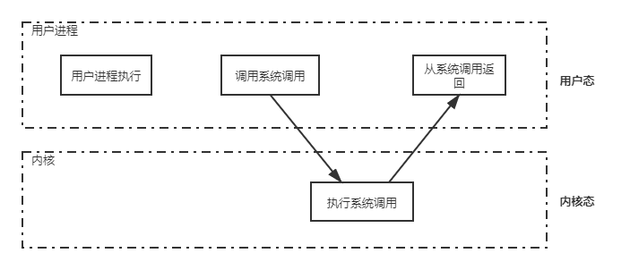

# 操作系统知识点

## 一. 概论

### 1.1 基本概念

#### 1.1.1 概念

1. 计算机系统分为**硬件、操作系统、应用程序和用户**
2. 操作系统控制和协调各用户的应用程序对硬件的分配和使用
3. 操作系统：**控制和管理整个计算机系统的硬件和软件资源，并合理地组织和调度计算机的工作和资源的分配，以提供给用户和其他软件方便的接口和环境的程序集合。**

#### 1.1.2 特征

1. **并发 Concurrence**
   两个或多个事件在同一时间间隔内发生。
   操作系统的并发性：计算机系统中同时存在多个运行着的程序，具有处理和调度多个程序的能力。
   **并发不等于并行**
2. *共享 Sharing**（资源共享）
   - 互斥共享：B必须等待A使用完资源后，B才可以访问该资源。该资源为临界资源、独占资源。（打印机、栈、变量）
   - 同时访问：宏观上是同时访问资源，微观上交替对资源进行访问。（磁盘）

3. **虚拟 Virtual**
   把物理上的实体变为若干个逻辑上的对应物。虚拟处理器、虚拟存储器
4. **异步 Asynchronism**
   允许多个程序并发执行，但由于资源有限，进程执行不是一贯到底，而是走走停停，以不可预知速度向前推进，这是进程的异步性。

#### 1.1.3 目标和功能

1. 操作系统作为计算机系统资源管理者
   - **处理机管理**：在多道程序环境下，处理及的分配和运行都以进程（或线程）为基本单位，因而对处理机的管理可归结为对进程的管理。主要功能有：**进程控制、进程同步、进程通信、死锁处理、处理机调度**等
   - **存储器管理**：为多道程序提供良好环境，方便用户使用和提高内存使用率。**内存分配、地址映射、内存保护与共享和内存扩充**等。
   - **文件管理**：**文件存储空间的管理、目录管理和文件读写管理和保护**等。
   - **设备管理**：**缓冲管理、设备分配、设备处理和虚拟设备**等。
   - 操作系统作为用户与计算机硬件系统之间的接口
     - **命令接口**：交互式命令接口。如终端输入命令。批处理命令接口。
     - **程序接口**：由系统调用命令组成。

### 1.2 发展和分类

1. **手工操作**
2. **批处理**
3. **分时操作系统**
4. **实时操作系统**
5. **网络操作系统和分布式计算机系统**
6. **个人计算机系统**

### 1.3 运行环境

#### 1.3.1 运行机制

操作系统内核程序**“管理”**用户自编程序；**“管理程序”**可以执行**特权指令**；操作系统在具体实现上划分为**用户态**和**核心态**。

1. 时钟管理
2. 中断机制
3. 原语：最底层、最接近硬件；运行具有原子性，只能一气呵成；运行时间短，调用频繁
4. 系统控制的数据结构和处理：作业控制块、进程控制块PCB、设备控制块、各类链表、消息队列、缓冲区、空闲区登记表、内存分配表等
   - 进程管理：进程状态管理、进程调度和分派、创建与撤销进程控制块。
   - 存储器管理：存储器的空间分配和回收、内存信息保护程序、代码对换程序。
   - 设备管理：缓冲区管理、设备管理和回收。

#### 1.3.2 中断和异常

1. **中断 Interruption** （**外中断**）。与当前运行程序无关，CPU执行指令以外的事件的发生。如设备发出的IO中断，表示输入输出处理完成；时钟中断，表示一个固定的时间片已到，让处理机处理计时、定时运行的任务。
2. **异常 Exception** （**内中断**）。CPU执行指令内部的事件。如程序非法操作码、数组越界、算术溢出、虚存系统缺页等。

#### 1.3.3 系统调用

各类共享资源由操作系统统一掌管，在用户程序中凡是和资源有关的操作都要经过系统调用。如存储分配、IO传输以及文件管理等。

**设备管理**：完成设备请求和释放，以及设备启动

**文件管理**：完成文件的读、写、创建、删除操作

**进程控制**：完成进程的创建、撤销、阻塞和唤醒

**进程通信**：完成进程之间消息传递及信号传递

**内存管理**：完成内存的分配、回收以及获取作业占用内存区大小及始址。

系统调用运行在系统核心态。通过系统调用来使用系统功能，可以保证系统功能稳定性和安全性。系统调用命令是由操作系统提供的一个或多个子程序模块实现的。

### 1.4 体系结构

1. **大内核和微内核**
   - *大内核**：把操作系统的主要功能模块都作为一个整体运行在核心态，为应用提供高性能的系统服务。各模块共享信息，具有性能优势。**
   - 微内核**：分离了内核与服务、服务与服务，使相互之间接口更加清晰，维护代价大大降低，保障了系统的可靠性。但是降低了性能，需要频繁得在核心态和用户态之间切换。

### 1.5 难点

1. **并发行和并行性的区别和联系**
2. *特权指令和非特权指令
3. 访管指令和访管中断**

## 二、进程管理

### 2.1 进程与线程

#### 2.1.1 进程的概念

1. 引入进程的概念，更好的描述和控制程序的并发执行，实现操作系统的**并发行和共享性**；

2. 系统利用进程控制块（Process Control Block）来描述进程的基本情况和运行状态，进而控制和管理进程；

3. 程序段、相关数据段和PCB三部分构成了**进程映像（进程实体）**，创建进程实质创建进程映像中的PCB，撤销进程实质撤销进程的PCB；

4. **进程映像是静态的，进程是动态的**。**PCB是进程存在的唯一标志**

5. **进程是进程实体的运行过程，是系统进行资源分配和调度的一个独立单位**。这里的系统资源指处理机存储器和其他设备服务于某进程的时间，也就是处理机的时间片。因此这就决定了进程是一个动态的、过程性的概念。

6. 进程的特征

   由多道程序并发执行而引出的概念，与程序截然不同。

   - 动态性：进程是程序的一次执行，创建、活动、暂停、终止，具有一定生命周期，**动态性是最基本的**特征。
   - 并发性：多个进程实体，同存于内存中，在一段时间同时运行。引入进程的目的就是为了使程序与其他进程的程序并发执行，提高资源利用率。
   - 独立性：进程是一个独立获得资源，独立运行和独立接受调度的基本单位。
   - 异步性：由于进程的相互制约，是进程具有执行的间断性，即进程按照各自独立不可预知的速度向前推进。因此，异步性会导致结果不可再现，需要配置相同的进程同步机制。
   - 结构性：每个进程配置一个PCB进行描述，进程实体由程序段、数据段和进程控制段三部分组成。

#### 2.1.2 进程的状态和转换

  1. 运行状态：进程在处理机上运行，单处理机环境下，每一个时刻最多只有一个进程处于运行状态。
  2. 就绪状态：进程处于准备运行的状态，进程获取了除处理机外的一切所需资源，一旦得到处理机即可运行。
  3. 阻塞状态（等待状态）：进程正在等待某一事件而暂停运行，如等待某资源为可用（输入输出完成）。即使处理机空闲，进程也不能运行。
  4. 创建状态：进程正在被创建，尚未转到就绪状态。
  5. 结束状态：进程正在从系统中消失，可能是进程正常结束或其他原因中断退出运行。

> 注意区别**就绪状态和等待状态**：就绪状态是进程获取了除处理机外的一切所需资源，一旦得到处理机即可运行。等待状态指进程需要其他资源或等待某一事件。之所以把处理机资源和其他资源分开，是因为在分时系统的进程时间片轮换机制中，每个进程分到的时间片是若干毫秒（进程得到处理机的时间很短且频繁，进程在运行过程中实际上是频繁转换到轮换状态的）；而其它资源的使用和分配或某一事件的发生对应时间相对很长，进程转换次数相对较少。

  > 1. 就绪->运行：经过调度后，获得处理机资源，由就绪状态转为运行状态。
  >
  > 2. 运行->就绪：运行状态的进程时间片用完后，不得不让出处理机。在可剥夺的操作系统中，优先级高的进程会抢占优先级低的进程，使其进入就绪状态。
  > 3. 运行->阻塞：进程**主动**请求某一资源使用和分配或等待某一事件发生（IO操作完成），就由运行状态转为阻塞状态。
  > 4. 阻塞->就绪：进程**被动**等待事件到来时，如IO操作或中断结束时，中断处理程序会将进程从阻塞状态转换为就绪状态。

#### 2.1.3 进程控制

1. 进程创建

   父进程可以创建子进程，子进程继承父进程的所有资源。子进程撤销时归还资源给父进程，父进程撤销时也要撤销所有子进程。

   1. 先分配唯一的进程标识号，申请一个空白的PCB。
   2. 为进程分配资源，为新进程的程序和数据，以及用户栈分配必要的内存空间。资源不足（内存空间），不是创建失败，而是进入等待。
   3. 初始化PCB，初始化标识信息，初始化处理机状态信息、控制信息，设置进程优先级。
   4. 如果进程就绪队列能够接纳新进程，则压入队列，等待被调度运行。

2. 进程终止

   **正常结束**，进程任务已经完成准备退出运行；**异常结束**，表示进程在运行时，发生异常事件，存储区越界、保护错、非法指令、特权指令错、IO故障等；**外界干预**，进程外界请求而终止运行，如操作员或操作系统干预、父进程请求或父进程终止。

   终止进程的过程：

   1. 根据进程标识符，检索PCB，从中读出进程状态
   2. 若进程处于执行状态，则立即终止进程的执行，将处理机资源分配给其他进程
   3. 若进程还有子进程，则终止所有子进程
   4. 将该进程所有的资源归还给父进程或操作系统
   5. 将该PCB从链表中删除

3. 进程阻塞和唤醒

   正在执行的进程，由于期待的事件未发生，如请求资源失败、等待某些操作完成、新数据尚未到达或无新工作可做，则由系统执行阻塞原语，使其变为阻塞状态。进程阻塞是进程的一种**主动**行为，因此只能有正在执行中的进程转为阻塞状态。

   1. 根据标识号找到对应PCB
   2. 若为执行状态，则保护现场，将其转为阻塞状态，停止运行
   3. 把PCB插入到相应事件的等待队列中大王

   当阻塞中的进程所等待的事件发生，则有由有关进程调用唤醒原语，将等待该事件的进程唤醒。

   1. 在该等待队列中找到相应的进程PCB
   2. 将该进程从等待队列中移出，将其置为就绪状态
   3. 把该PCB插入到就绪队列中，等待调度程序调度

4. 进程切换

   进程切换是指处理机从一个进程的运行转到另一个进程上运行。

   1. 保存处理机上下文，包含程序计数器和其他寄存器

   2. 更新PCB信息

   3. 把进程PCB移入相应队列，如就绪、在某事件阻塞队列

   4. 选择另一个进程执行，更新PCB

   5. 更新内存管理的数据结构

   6. 恢复处理机上下文

> 调度和切换的区别：调度始址决定资源分配给哪个进程的行为，是一种决策行为；切换是指实际分配的行为，是执行行为。先有资源的调度，然后才有进程的切换。

#### 2.1.4 进程的组织

1. **进程控制块**PCB

   PCB时进程实体的一部分，是进程存在的唯一标志；主要包括进程描述信息、进程描述信息、进程控制和管理信息、资源分配清单和处理机相关信息。

   对于不同状态的进程，PCB需要用适当的方法组织起来。常见的组织方式为链式和索引两种。

2. 程序段：被进程调度程序调度到CPU执行的程序代码段。多个进程可以运行同一程序。

3. 数据段：可以是对应的程序加工处理的原始数据，也可以是程序及执行时产生的中间和最终结果。

#### 2.1.5 进程的通信

1. 共享存储
  在通信的进程之间存在一块可直接访问的共享空间，通过这片共享空间进行读写操作实现进程之间的信息交换。在进行读写操作时，需要使用同步互斥工具（PV操作）。共享存储分为两种，低级方式的共享时基于数据结构的共享；高级方式基于存储区的共享。操作系统**只负责为通信进程提供可共享使用的存储空间和同步互斥工具**，而**数据交换则由用户自己安排读写完成**。

  > 用户进程空间一般都是独立的，进程运行期间不能访问其他进程的空间，要想让两个进程共享空间必须通过特殊的系统调用实现，**进程内的线程是自然共享进程的**。

2. 消息传递

  消息传递系统中，进程间的数据交换是以**格式化的消息**为单位的。若进程间不存在可直接访问的共享空间，必须利用操作系统提供的消息传递方法实现进程通信。

  1. 直接通信方式：发送进程直接把消息发送给接收进程，将其挂在接收进程的消息缓冲队列上，接收进程从队列中取得消息。
  2. 间接通信方式：发送进程把消息发送到某个中间实体，接收进程从中间实体取得消息。中间实体一般称为信箱，故又称为**信箱通信方式**。广发应用于计算机网络如电子邮箱。

3. 管道通信

  消息传递的一种特殊的方式。管道，是指连接一个读进程和一个写进程以实现它们之间通信的一个共享文件。写进程以字符流的形式将大量数据送入写管道；读进程，则从管道中接收数据，管道机制必须提供三方面的协调能力：互斥、同步和确定对方存在。

  > Linux管道可以克服利用文件通信的问题
  >
  > 1. 限制管道的大小，限制写入数据大小，超过管道大小后写进程会进入堵塞状态，等待管道中的数据被读取。
  > 2. 读进程可能工作得比写进程快，所有进程数据被读取后，管道变空。读取进程进入堵塞状态，等待数据写入。
  >
  > 管道只能采取**半双工通信**，即某一时刻只能单向传输，要实现父子进程双向通信需要定义两个管道。
  >
  > 管道可以理解为共享存储的优化和发展，共享存储不允许同时对存储区进行读取和写入。而管道将存储区优化成了缓冲区，使读进程和写进程可以同时进行读操作和写操作。不会因为还有数据写入而造成阻塞。写进程将管道写满后才让读进程读取数据，当缓冲区还有数据时，写进程不会写入数据。

#### 2.1.6 线程概念与多线程模型

1. 线程概念

   减小程序在并发执行时所付出的时空开销，提高操作系统的并发性能。

   可直接理解为”轻量级线程“，是CPU的一个基本执行单元，程序执行流的最小单元。

   由线程ID、程序计数器、寄存器集合和堆栈组成。

   线程是进程中的一个实体，本身不拥有系统资源，只拥有运行中必不可少的资源，但是它可以与同属一个进程的所有线程共享进程所拥有的全部资源。

   线程也有就绪、阻塞和运行三种状态。进程只作为除CPU以外系统资源的分配单元，线程则作为处理机的分配单元。

2. 线程和进程比较
   1. 调度：在引入线程之前，进程是拥有资源和独立调度的基本单位。引入线程之后，**线程是独立调度的基本单位**，**进程是拥有资源的基本单位**。

   2. 拥有资源

      进程是拥有系统资源的基本单位，线程不拥有系统资源，但线程可以访问隶属进程的系统资源。因此同一进程内进行线程的切换所花开销小于进程切换。

   3. 并发性

      引入线程后，不仅进程间可以实现并发，单一进程内也可以实现并发。

   4. 系统开销

      创建或撤销进程所耗的系统开销远大于创建或撤销线程所耗的开销。进程切换时涉及当前进程CPU环境的保存及新调度到进程进程CPU环境的设置，而线程切换只需设置少量的寄存器，开销很小。

   5. 地址空间和其他资源

      进程地址空间相互独立，同一进程的线程共享进程的资源，某一进程内的线程对其他进程不可见。

   6. 通信

      进程间通信IPC需要进程同步和互斥手段的辅助，线程可以通过全局变量进行通信。

3. 线程的属性

   多线程操作系统中，把线程作为独立运行的基本单位，此时的进程，已不再是一个基本的可执行实体。执行中的进程是指进程中的一个线程正处于执行状态。

> 1. 线程是一个轻量实体，不拥有系统资源，每个线程拥有一个唯一标识符和一个线程控制块，线程控制块记录线程执行的寄存器和栈等现场情况。
> 2. 不同线程可以执行相同程序。
> 3. 同一进程中的各个线程共享进程的资源。
> 4. 线程时处理机的独立调度单位，多个线程是可以并发执行的。单CPU计算机系统，个线程可交替占用CPU；在多CPU计算机系统中，各线程可以占用不同的CPU，各个CPU同时为一个进程中的线程服务可以缩短进程的处理时间。
> 5. 线程被创建出来便开始了生命周期，直至终止，线程在生命周期内会经历阻塞、就绪和运行状态。

4. 线程实现方式
   1. 用户级线程（User-Level Thread）

      有关线程管理的工作全部交由应用程序完成，内核意识不到线程的存在。应用程序通过使用线程库设计多线程程序。应用程序从单线程开始运行，在运行时任意时刻可以派生出新线程。

   2. 内核级线程（Kernel-Level Thread）

      线程管理工作交由内核完成，应用程序没有进行线程管理的代码

> 在一些系统中，使用组合方式实现多线程，线程创建、调度和同步在应用程序中进行。一个应用程序的多个用户级线程映射到一些内核级线程上。

5. 本章小结
   - 为什么引入进程
   - 什么是进程？进程由什么组成？
   - 进程如何解决问题？

### 2.2 处理机调度

#### 2.2.1 调度的概念

1. 基本概念

   多道程序系统中，进程的数量往往多于处理机个数。处理机调度是指从就绪队列中按照一定算法公平高效的选择一个进程将处理机分配给它运行。

2. 调度的层次
   1. 作业调度（高级调度）

      按一定规则从外存上处于后备状态的作业中挑选一个或多个作业，给他们分配内存、输入输出设备等必要资源，并建立相应的进程。**使它们获得竞争处理机的机会**。

      > 多道批处理系统大多配有作业调度，其他系统一般没有。作业调度执行频率较低，通常几分钟一次。

   2. 中级调度（内存调度）

      **提高内存利用率和系统吞吐量**。将暂时不能运行的进程调至外存等待，把进程状态设为挂起状态。当他们已具备执行条件又有足够内存空间，由中级调度来决定。将外存具备运行条件的进程调入内存，令其状态设为就绪状态，挂在就绪队列上等待。

   3. 进程调度（低级调度）

      按照**某种方法和策略**从就绪队列中选取一个进程，将处理机分配给它。进程调度是操作系统中最基本的一种调度。一般操作系统中都必须配置进程调度。

3. 三级调度关系

> 1. 作业调度为进程活动做准备，进程调度使进程正常活动起来，中级调度将暂时不能运行的进程挂起，**中级调度处于作业调度和进程调度之间**。
> 2. 作业调度次数最少，中级调度略多，进程调度最频繁
> 3. **进程调度是最基本的，不可或缺**。

#### 2.2.2 调度的时机、切换与过程

请求调度的事件发生后，才可能会运行进程调度程序，当调度了就绪程序后，才会去进行进程间的切换。理论上三件事应该顺序执行，但在实际设计中，并不一定马上进行调度和切换。

> 1. 处理中的的过程
> 2. 操作系统内核程序临界区
> 3. 需要完全屏蔽中断的原子操作

应该进行进程调度与切换的情况

> 1. 发生引起调度的条件，且当前进程无法继续进行下去时，马上进行调度和切换。实现了**非剥夺方式调度**。
> 2. 当中断处理或自陷处理结束后，返回被中断进程的用户态程序执行现场前，置上请求调度标志，即可马上进行调度和切换。实现了**剥夺方式的调度**。

#### 2.2.3 进程调度方式

1. 非剥夺方式调度

   一个程序在处理机上运行时，即使更为紧迫和重要的进程进入就绪队列，仍然让当前进程继续运执行，直到进程完成或发生某个时间进入阻塞状态。

2. 剥夺方式的调度

   一个进程运行在处理机上，如果更为优先的进程进入就绪队列，则将当前正在执行的进程暂停，将处理机分配给更为重要的进程。

#### 2.2.4 调度的基本准则

满足系统用户的要求；考虑系统整体效率；考虑调度算法开销

1. CPU利用率：尽量使CPU保持忙碌状态

2. 系统吞吐量：单位时间CPU完成作业数量

3. 周转时间：作业从提交到完成所经历的时间

   > 周转时间=作业完成时间-作业提交时间
   >
   > 平均周转时间=（作业1周转时间+作业2周转时间+......）/n
   >
   > 带权周转时间=作业周转时间/作业实际运行时间
   >
   > 平均带权周转时间=（作业1带权周转时间+作业2带权周转时间+......）/n

4. 等待时间：进程处于等处理机时间之和。**处理机调度算法实际上并不影响作业执行或输入输出的时间，只影响作业在就绪队列中等待的时间**。

5. 响应时间：用户提交请求到系统首次产生相应所用时间。

#### 2.2.5 典型的调度算法

1. 先来先服务FCFS

  可以用于**作业调度/进程调度**；是**不可剥夺**算法，长作业先到达会导致后续作业长时间等待，不能用于分时系统和实时系统。经常和其他策略调度算法结合使用，如优先级调度算法，相同优先级按照FCFS算法进行调度。

2. 短作业优先SJF

  从后备队列中选取一个或多个估计运行时间最短的作业调入内存运行，直到完成或发生某事件而阻塞，才释放处理机。

  > 对长作业不利，会造成饥饿现象
  >
  > 未考虑作业紧迫程度，不能确保紧迫作业被及时处理
  >
  > 作业长短是用户估计执行时间而决定，因此不能真正做到短作业优先。

3. 优先级调度

  作业调度/进程调度；从后备队列中选取一个或多个优先级最高的作业调入内存运行。

  > 1. 非剥夺式优先级调度
  >
  >    当一个进程在处理机上正在运行时，即使某个优先级更高的进程进入就绪队列，仍然让正在运行的进程继续执行，直到让出处理机资源
  >
  > 2. 剥夺式优先级调度
  >
  >    当一个进程在处理机上正在运行时，某个优先级更高的进程进入就绪队列，立即暂停正在运行的进程，将处理机分配给更为重要的资源
  >
  > 3. 静态优先级
  >
  >    优先级在创建进程时已经确定，在进程运行过程中保持不变。确定优先级依据有进程类型、进程对资源的要求、用户要求等
  >
  > 4. 动态优先级
  >
  >    根据进程情况变化动态调整优先级。调整依据为进程占用CPU时间长短、就绪进程等待CPU时间的长短。

4. 高响应比优先调度

  主要用于作业调度；FCFS和SJF的综合平衡，同时考虑每个作业的等待时间和估计的运行时间。进行调度前先计算后备队列进程的响应比，选出最高响应比的进程。

  > 响应比Rp=（等待时间+要求服务时间）/要求服务时间
  >
  > 1. 当作业等待时间相同时，要求服务时间越短则响应比越高，有利于短作业
  > 2. 要求服务时间相同时，响应比由等待时间决定，等待时间越长响应比越高，实现先来先服务策略
  > 3. 对于长作业，响应比随等待事件增加而提高，等待足够长时，响应比升高很多，从而也会获得处理机资源，**解决了饥饿问题，兼顾了长作业**

5. 时间片轮转调度

  用于分时系统；将所有就绪进程按到达时间排列，选择第一个进程执行，执行一个时间片后，即使进程未完成其运行，也要释放出处理机资源，切换到下一个进程，以此不断地循环。

  如果时间片设置很大，则所有进程都会在一个时间片完成，算法退化为FCFS；如果设置很小，则处理机资源在进程间切换过于频繁，是处理机调度开销增大，运行进程时间缩小。

6. 多级反馈队列

  时间片轮换调度算法和优先级调度算法的综合与发展。动态调整进程优先级和时间片大小，兼顾多方面的系统目标。

  > 1. 设置多个就绪队列，为各个队列赋予不同的优先级。
  > 2. 赋予各个队列进程执行时间片大小不同，优先级高的队列运行时间片短
  > 3. 新进程进入内存后，先进入1级队列末尾，按FCFS策略调度运行，到该进程执行时，如果能够在指定时间片内完成则撤出系统，否则将该进程转入2级队列末尾，以此类推
  > 4. 仅当1~i-1队列为空时，系统才会调度运行i级队列中的进程；如果处理机正在运行第i级队列中的进程，此时，有进程被调度进入1~i-1队列末，则新进程会抢占处理机资源，系统会把处理及分配给更高优先级的资源。

7. 本章小结

  1. 为什么要进行处理机调度？
  2. 调度算法有几种？

### 2.3 进程同步

#### 2.3.1 进程同步基本概念

1. **临界资源**

   一次只允许一个进程访问的资源，如打印机等物理设备。对临界资源的访问必须互斥地进行，每个进程中，访问临界资源的那段代码称为**临界区**。 

   > 把临界区的访问分为四个区：
   >
   > 1. 进入区：检查能否进入临界区，能进入则设置正在访问临界区地标志
   > 2. 临界区：访问临界资源地那段代码
   > 3. 退出区：将正在访问临界区地标志清除
   > 4. 剩余区：代码中其余部分

2. 同步

   为直接制约关系；为完成任务而建立的两个或多个进程在某些位置上要协调工作次序而等待、传递信息所产生地制约关系。

3. 互斥

   为间接制约关系；一个进程进入临界区使用临界资源时，另一个进程必须等待，等待占用临界区地进程退出临界区后，才能够访问临界资源。

   > 1. 空闲让进
   > 2. 忙则等待
   > 3. 有限等待：保证进程在有限时间进入临界区
   > 4. 让权等待：进程不能进入临界区时，应立即释放处理器，防止进程忙等待

#### 2.3.2 实现临界区互斥的基本方法

1. 软件实现法

   > 单标志法
   >
   > 双标志法先检查
   >
   > 双标志法后检查
   >
   > Peterson Algorithm

2. 硬件实现法

   > 中断屏蔽方法
   >
   > 硬件指令方法

#### 2.3.3 信号量

1. 整型信号量

   未遵循让权等待，会让进程处于忙等待

2. 记录型信号量

   克服了忙等待，利用一个记录型的数据结构

3. 利用信号量实现同步

4. 利用信号量实现进程互斥

5. 利用信号量实现前驱关系

6. 分析进程同步和互斥的方法步骤

#### 2.3.4 管程

1. 管程的定义
2. 管程的组成
3. 管程的基本特性

#### 2.3.5 经典同步问题

1. 生产者-消费者问题
2. 读者写者问题
3. 哲学家进餐问题
4. 吸烟者问题

#### 2.3.6 本章小结

1. 为什么要引入进程同步的概念？
2. 不同进程之间存在哪些关系？

### 2.4 死锁

#### 2.4.1 死锁概念

1. 进程在并发运行时因为竞争资源而造成的僵局，互相等待，若无外力作用，进程将无法向前推进。

2. 死锁产生的原因：

   - 系统资源的竞争

     不可剥夺资源，数量不足以满足多个进程运行的需要

   - 进程推进顺序非法

     进程在运行过程中，请求和释放资源顺序不当

   - 死锁产生的必要条件

     互斥条件：进程要求对所分配的资源进行排他性控制，即在一段时间只能为一个进程所有

     不剥夺条件：进程所获资源在未使用完毕之前不能被其他进程夺走，即资源只能被进程主动释放。

     请求和保持条件：进程已经获得了一个资源，但又提出了新的资源请求，而该资源只能被其它进程占有，此时请求进程被阻塞，但对自己所获资源不释放。

     循环等待条件：存在进程资源的循环等待链

#### 2.4.2 死锁的处理策略

|                  | 资源分配策略             | 各种可能模式                             | 主要优点                                     | 主要缺点                                                     |
| ---------------- | ------------------------ | ---------------------------------------- | -------------------------------------------- | ------------------------------------------------------------ |
| 预防死锁         | 保守，宁可闲置资源       | 一次请求所有资源，资源剥夺，资源按序分配 | 适用于做突发式处理的进程，不必进行剥夺       | 效率低，进程初始化时间延长；剥夺次数过多；不便灵活申请新资源 |
| 避免死锁         | 预防和检测的折中         | 寻找可能的安全顺序                       | 不必进行剥夺                                 | 必须知道将来资源的需求；进程不被长时间阻塞                   |
| 死锁的检测及解除 | 宽松，只要允许就分配资源 | 定期检查死锁已经发生                     | 不延长进程初始化时间，允许对死锁进行现场处理 | 通过剥夺解除死锁，造成损失                                   |

#### 2.4.3 死锁预防

破环死锁产生的四个必要条件之一

1. 破环互斥条件：能共享，则共享。如果不能共享资源，则无法破环互斥条件
2. 破坏不剥夺条件：一个保持某些不可剥夺资源的进程，当请求资源得不到满足，必须释放已经获取的资源，之后再重新申请。释放资源会导致前一阶段工作实效，反复申请资源将加大系统开销，因此适合易于保存和恢复的资源，如CPU寄存器和内存资源
3. 破环请求和保持条件：一次申请进程所需所有资源，未满足则不进入运行，一进入运行所有资源一直归其所有。系统资源严重浪费，有些资源会在程序初期或结束时才使用，甚至不使用，导致其它进程的饥饿现象。
4. 破坏循环等待条件：顺序资源分配法

#### 2.4.4 死锁避免

1. 系统安全状态

  按照某种进程推进策略，为每个进程Pi分配器所需资源，直至满足每个进程对资源的最大需求，是每个进程可以顺序完成

2. 银行家算法

  Available

  Max

  Allocation

  Need

3. 安全性算法举例

#### 2.4.5 死锁检测与解除

1. 资源分配图
2. 死锁定理
3. 死锁解除

#### 2.4.6 本章小结

1. 为什么会产生死锁？产生死锁有什么条件？
2. 有什么办法解决死锁？

### 2.5 本章疑难点

1. 进程与程序的区别和联系
2. 死锁与饥饿
3. 银行家算法工作原理
4. 进程同步、互斥的区别和联系
5. 作业和进程的关系

## 三、内存管理

### 3.1 内存管理概念

#### 3.1.1 内存管理概念

将内存空间进行合理划分和有效的动态分配。操作系统对内存的划分和动态分配。就是内存管理的概念。

1. 内存管理的功能：
   1. 内存空间的分配与回收：操作系统完成主存储器空间的分配和管理，使程序员摆脱存储分配的麻烦，提高编程效率
   2. 地址转换：将程序逻辑地址转换为相应物理地址
   3. 内存空间的扩充：利用虚拟存储技术或自动覆盖技术从逻辑上扩充内存
   4. 存储保护：保证各道作业在各自存储空间运行，互不干扰

2. 进程运行基本原理和要求
   1. 程序装入和链接

      - 编译：编译器将用户代码编译成若干个目标模块
      - 链接：链接程序将编译后形成的一组目标模块及所需库函数链接在一起，形成完整的装入模块
      - 装入：装入程序将装入模块装入内存运行

      链接方式：

      - 静态链接
      - 装入时动态链接
      - 运行时动态链接
        1. 绝对装入：装入到固定内存的位置，逻辑地址与物理地址相同
        2. 可重定位装入：根据内存当前情况将装入模块装入到合适位置，装入时对目标程序的指令和数据的修改成为重定位，地址变换一次完成，又称**静态重定位**。作业装入内存时，必须分配要求的全部内存空间。装入后地址空间固定。
        3. 动态运行装入：**动态重定位**， 把地址转换推迟到程序执行时进行，装入内存后所有地址均为相对地址，需要重定位寄存器支持。

   2. 逻辑地址空间与物理地址空间

   3. 内存保护

      - CPU上、下限寄存器
      - **重定位寄存器**和**界地址寄存器**

#### 3.1.2 覆盖与交换

扩充内存

1. 覆盖：将内存分配成固定区和若干覆盖区，活跃的部分放在固定区，其余部分按调用关系分段，即将访问放于覆盖区，其余放于外存，需要调用前在对覆盖区进行覆盖。**对用户不透明**
2. 交换：把处于等待状态的程序从内存移动到辅存，把内存空间腾出来，这一过程叫**换出**；把准备好竞争CPU运行的程序从辅存移动到内存，这一过程叫**换入**。中级调度就是交换技术。

> 交换技术主要是在不同进程之间进行，覆盖则用于同一程序或进程中。
>
> 对于主存无法存放用户程序的矛盾现代操作系统时通过虚拟内存技术来解决的。

#### 3.1.3 连续分配管理方式

1. 单一连续分配

2. 固定分区分配：产生**内碎片**

3. 动态分区分配：产生**外碎片**

  1. 首次适应
  2. 最佳适应

  3. 最坏适应
  4. 邻近适应

|                  | 作业道数 | 内部碎片 | 外部碎片 | 硬件支持                 | 可用空间管理 | 解决碎片方法 | 解决空间不足 | 提高作业道数 |
| ---------------- | -------- | -------- | -------- | ------------------------ | ------------ | ------------ | ------------ | :----------- |
| 单道连续分配     | 1        | 有       | 无       | 界地址寄存器、越界检查器 |              |              | 覆盖         | 交换         |
| 多道固定连续分配 | <=N      | 有       | 无       |                          |              |              |              |              |
| 多道可变连续分配 |          | 无       | 有       |                          | 数组、链表   | 紧凑         |              |              |

#### 3.1.4 非连续分配管理方式

1. 基本分页存储管理方式

  把主存空间划分为大小相等且固定的块，块相对较小，作为主存基本单位。进程也按块进行划分，进程执行过程中，以块为单位逐个申请主存中的块空间。

  **分页管理不会产生外碎片**，尽管会产生内碎片，但是由于块相对较小，对于进程来说平均只会产生半个块大小的内部碎片

  1. 分页存储的基本概念

     - 页面和页面大小

       进程中的块成为页Page；内存中的块成为页框Page Frame；外存中直接称为块Block

     - 地址结构：页号+页内偏移量

     - 页表：页号（隐含）+块号

  2. 基本地址变换机构

     - 页表寄存器PTR：包含页表起始地址，页表长度

     

  3. 具有快表的地址变换机构

     TLB

     

  4. 两级页表

2. 基本分段存储管理方式

  1. 分段

  2. 段表

  3. 地址变换机构

     

  4. 段的共享与保护

3. 段页式管理方式

   

   

#### 3.1.5 本节小节

1. 为什么要进行内存管理？
2. 页式管理每个页表项大小的下限如何决定？
3. 多级页表解决了什么问题？会带来什么问题？

### 3.2 虚拟内存管理

#### 3.2.1 虚拟内存的基本概念

1. 传统存储管理方式的特征
2. 局部性原理
3. 虚拟存储器的定义和特征
4. 虚拟内存技术的实现

#### 3.2.2 请求分页管理方式

1. 页表机制
2. 缺页中断机构
3. 地址变换机构

#### 3.2.3 页面置换算法

1. OPT
2. FIFO
3. LRU
4. CLOCK(NRU)
5. 改进型CLOCK

#### 3.2.4 页面分配策略

1. 驻留集大小
   - 固定分配局部置换
   - 可变分配全局置换
   - 可变分配局部置换
2. 调入页面时机
   - 预调页策略
   - 请求调页策略
3. 从何处调入页面

#### 3.2.5 抖动

#### 3.2.6 工作集

#### 3.2.7 地址翻译

#### 3.2.8 本节小结

1. 为什么要引入虚拟内存？
2. 虚拟内存空间的大小由什么因素决定？
3. 虚拟内存是怎么解决问题的？会带来什么问题？

### 3.3 本章疑难点

1. 分页分段比较

## 四、文件管理

### 4.1 文件系统基础

#### 4.1.1 文件的概念

1. 文件的定义
2. 文件的属性
   - 名称
   - 标识符
   - 类型
   - 位置
   - 大小
   - 保护
   - 时间、日期和用户标识
3. 文件的基本操作
   - 创建文件
   - 写文件
   - 读文件
   - 文件重定位
   - 删除文件
   - 截断文件
4. 文件的打开与关闭

#### 4.1.2 文件的逻辑结构

1. 无结构文件
2. 有结构文件
   - 顺序文件
   - 索引文件
   - 索引顺序文件

#### 4.1.3 目录结构

1. 文件控制块和索引节点
   - 文件控制块FCB
   - 索引节点
2. 目录结构
   - 单级目录结构：文件不能重名
   - 两级目录结构：每个用户不可以进行文件分类
   - 多级目录结构
   - 无环图目录结构：可以实现文件共享

#### 4.1.4 文件共享

1. 基于索引节点的共享方式（硬链接）
2. 利用符号链实现文件共享（软链接）

#### 4.1.5 文件保护

口令保护、加密保护、访问控制

1. 访问类型

2. 访问控制

#### 4.1.6 本节小结

1. 什么是文件？什么是文件系统？
2. 文件系统要完成哪些功能？

### 4.2 文件系统实现

#### 4.2.1 文件系统层次结构

#### 4.2.2 目录实现

#### 4.2.3 文件实现

1. 文件分配方式

   - 连续分配：支持顺序、随机访问；不方便文件拓展；会产生磁盘碎片（外部碎片）

   - 链接分配

     1. 隐式（链表）：只支持顺序访问；方便文件拓展；不会产生碎片

     2. 显示（文件分配表FAT）：支持顺序和随机访问（FAT常驻内存）；方便文件拓展；不会产生碎

   - 索引分配

     1. 链接方案
     2. 多层索引
     3. 混合索引

2. 文件存储空间管理

   - 文件存储器空间的划分与初始化。物理盘：目录区，文件区
   - 文件存储器空间管理
     - 空闲表法
     - 空闲链表法：空闲盘块链，空闲盘区链
     - 位示图法
     - 成组链接法

#### 4.2.4 本节小结

1. 在目录中查找某个文件可以使用什么方法？
2. 文件的逻辑结构和物理结构有何区别？单个文件的逻辑结构和物理结构是否存在制约关系？

### 4.3 磁盘组织与管理

#### 4.3.1 磁盘组织与管理

#### 4.3.2 磁盘的结构

#### 4.3.3 磁盘调度算法

> 1. 寻找时间
> 2. 延迟时间
> 3. 传输时间
>

- FCFS
- SSTF
- SCAN
- CSCAN

> 磁盘扇区交替编号
>
> （柱面号、盘面号、扇区号）物理地址
>
> 不同盘面错位命名

#### 4.3.4 磁盘的管理

1. 磁盘初始化
2. 引导块
3. 坏块

#### 4.3.5 本节小结

1. 在磁盘上进行一次读写操作需要哪几部分时间？其中哪部分时间最长？
2. 存储一个文件时，一个磁道存储不下，剩下的部分存储在不同磁道好，还是同一柱面的不同盘面好？

### 4.4 本章疑难点

1. 磁盘结构
2. 内存结构
3. 文件系统实现概述
4. 混合索引分配实现

## 五、输入输出管理

### 5.1 I/O管理概述

#### 5.1.1 I/O设备

1. 人机交互设备

2. 存储设备
3. 网络通信设备
4. 块设备
5. 字符设备

#### 5.1.2 I/O控制方式

> I/O控制器组成
>
> 1. CPU与控制器之间的接口
> 2. I/O逻辑
> 3. 控制器与设备之间的接口
>
> I/O控制器功能
>
> 1. 接受和识别CPU发出的命令（控制寄存器）
> 2. 向CPU报告设备的状态（状态寄存器）
> 3. 数据交换（数据寄存器）
> 4. 地址识别

1. 程序直接控制方式

   CPU不断轮询查看状态寄存器

   每次读一个字

2. 中断驱动方式

   引入中断机制，CPU不需要不停的轮询

   每次一个字，会出现大量中断

3. DMA方式（直接存储器存取）

   单位为块，读取过程不需要CPU干预，每次读/写一个数据块

   > DMA控制器
   >
   > DR数据寄存器
   >
   > MAR内存地址寄存器
   >
   > DC数据计数器
   >
   > CR命令状态寄存器

4. 通信控制方式

   通道，一种硬件。通道可以识别并执行一系列的通道指令

   每次可读/写一组数据快

#### 5.1.3 I/O子系统的层次结构

1. 用户层软件
2. 设备独立性软件
   1. 向上层提供统一的调用接口
   2. 设备的保护
   3. 差错处理
   4. 设备的分配与回收
   5. 数据缓冲区管理
   6. 建立逻辑设备名到物理设备名映射关系

3. 设备驱动程序
4. 中断处理程序
5. 硬件

#### 5.1.4 本节小结

### 5.2 I/O核心子系统

#### 5.2.1 I/O子系统概述

#### 5.2.3 I/O**调度**概念

#### 5.2.4 高速缓存与缓冲区

#### 5.2.5 设备分配与回收

#### 5.2.6 SPOOLing技术

#### 5.2.7 本节小结